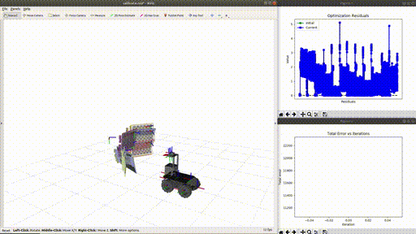
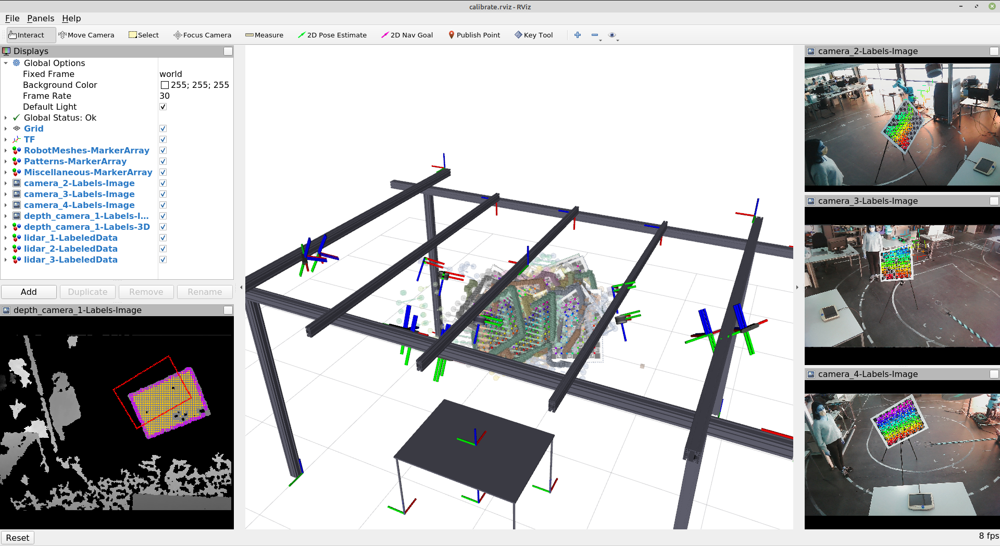
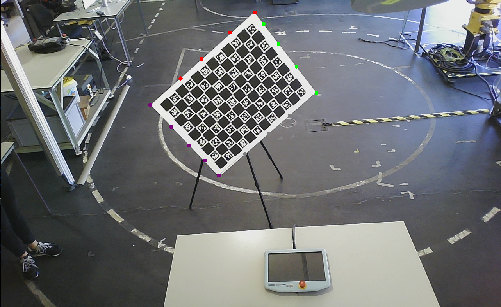
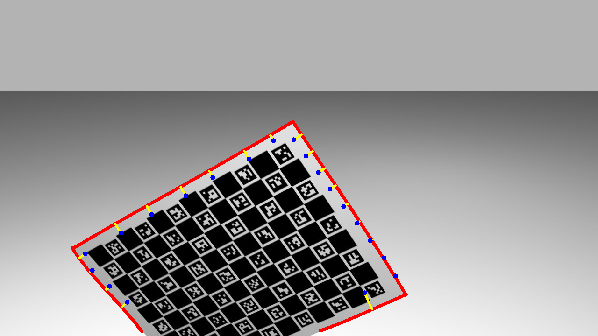

#  ATOM Calibration

###### A Calibration Framework using **A**tomic **T**ransformations **O**ptimization **M**ethod

**ATOM** is a set of calibration tools for multi-sensor, multi-modal, robotic systems, based on the optimization of
atomic transformations as provided by a ros based robot description.
Moreover, **ATOM** provides several scripts to facilitate all the steps of a calibration procedure.

If this work is helpful for you please cite our papers:

1. Oliveira, M., A. Castro, T. Madeira, E. Pedrosa, P. Dias, and V. Santos, A ROS framework for the extrinsic
   calibration of intelligent
   vehicles: A multi-sensor, multi-modal approach, Robotics and Autonomous Systems 131 (2020) p. 103558, ISSN:
   0921-8890, DOI: https://doi.org/10.1016/j.robot.2020.103558, 2020. [Bibtex](docs/bibtexs/Oliveira2020RAS.bib).

2. Pedrosa, E., M. Oliveira, N. Lau, and V. Santos, A General Approach to Hand–Eye Calibration Through the Optimization
   of Atomic Transformations, IEEE Transactions on Robotics (2021) pp. 1–15,
   DOI: https://doi.org/10.1109/TRO.2021.3062306, 2021. [Bibtex](docs/bibtexs/Pedrosa2021TRO.bib).

3. Aguiar, A., M. Oliveira, E. Pedrosa, and F. Santos, A Camera to LiDAR calibration approach through the Optimization
   of Atomic
   Transformations, Expert Systems with Applications (2021) p. 114894, ISSN: 0957-4174,
   DOI: https://doi.org/10.1016/j.eswa.2021.114894, 2021. [Bibtex](docs/bibtexs/Aguiar2021ESWA.bib)

## Table of Contents

  * [How to Use - Quick Start](#how-to-use---quick-start)
  * [Examples](#examples)
    + [Atlascar2](#atlascar2)
    + [IrisUA - ur10e](#irisua---ur10e)
    + [AgrobV2](#agrobv2)
    + [LARCC](#larcc)
    + [MMTBot](#mmtbot)
  * [System calibration - Detailed Description](#system-calibration---detailed-description)
    + [Setup you environment](#setup-you-environment)
    + [Creating a calibration package](#creating-a-calibration-package)
    + [Configuring a calibration package](#configuring-a-calibration-package)
    + [Set initial estimate](#set-initial-estimate)
    + [Collect data](#collect-data)
    + [Calibrate sensors](#calibrate-sensors)
        * [Advanced usage - running calibration script in separate terminal](#advanced-usage---running-calibration-script-in-separate-terminal)
        * [Advanced usage - two stage calibration for robotic systems with an anchored sensor](#advanced-usage---two-stage-calibration-for-robotic-systems-with-an-anchored-sensor)
  * [Evaluating your calibration](#evaluating-your-calibration)
  * [Evaluating your calibration](#evaluating-your-calibration-1)
      - [Annotation](#annotation)
      - [Camera-to-Camera evaluation](#camera-to-camera-evaluation)
      - [LiDAR-to-Depth-Camera evaluation](#lidar-to-depth-camera-evaluation)
      - [Camera-to-Depth-Camera evaluation](#camera-to-depth-camera-evaluation)
      - [LiDAR-to-LiDAR evaluation](#lidar-to-lidar-evaluation)
      - [LiDAR-to-Camera evaluation](#lidar-to-camera-evaluation)
      - [Point cloud image projection](#point-cloud-image-projection)
  * [Installation](#installation)
  * [Contributors](#contributors)
  * [Maintainers](#maintainers)

<small><i><a href='http://ecotrust-canada.github.io/markdown-toc/'>Table of contents generated with markdown-toc</a></i></small>


## How to Use - Quick Start

Unlike most other calibration approaches, **ATOM** offers tools to address the complete calibration pipeline. These are
instructions for quick starting your robotic system calibration. If you need more details read through
the [detailed description](#System-calibration---Detailed-Description) below.

Also, you can take a look at the
ATOM [youtube playlist](https://www.youtube.com/watch?v=BYs1-H9vh0s&list=PLQN09mzV5mbI4h5IQt3Eu9kugSk-08mnY).

1. **Create a calibration package** for you robotic system

```bash
rosrun atom_calibration create_calibration_pkg --name <your_robot_calibration>
```

2. **Configure your calibration package** - edit the file
   _<your_robot_calibration>/calibration/config.yml_ with your system information.

```bash
rosrun <your_robot_calibration> configure 
```

3. **Set initial estimate** [_optional_] - deployment of interactive tools based on rviz that allow the user to set the
   pose of the sensors to be calibrated, while receiving visual feedback;

```bash
roslaunch <your_robot_calibration> set_initial_estimate.launch 
```

4. **Collect Data** - Extraction of snapshots of data (a.k.a., collections) which constitute an ATOM dataset:

```bash
roslaunch <your_robot_calibration> collect_data.launch output_folder:=~/datasets/<my_dataset> 
```

5. **Dataset playback & Manual Annotation** [_optional_] - it is possible to visualize the labels automatically produced during the collection stage and correct them mannually:
   
```bash
roslaunch <your_robot_calibration> dataset_playback.launch
```
and then:
```bash
rosrun atom_calibration dataset_playback -json $ATOM_DATASETS/<your_robot_calibration>/<your_dataset>/dataset.json -uic -si  -ow
```

6. **Calibrate sensors** - finally run an optimization that will calibrate your sensors:

```bash
roslaunch <your_robot_calibration> dataset_playback.launch 
```


## Examples

ATOM provides extensive visualization possibilities while running the calibration optimization procedure. To visualize in ROS Rviz use the -rv flag.

<!-- [](https://www.youtube.com/watch?v=1NOEBKDMIpk) -->


So far, we have used **ATOM** to successfully calibrate several robotic platforms. Here are some examples:

### Atlascar2
 
[Atlascar2](https://github.com/lardemua/atlascar2) is an intelligent vehicle containing several cameras and 2D Lidars. 

### IrisUA - ur10e 
The [IrisUA - ur10e](https://github.com/iris-ua/iris_ur10e_calibration) includes several variants of the hand-eye calibration problem.


### AgrobV2 
 [AgrobV2](https://github.com/aaguiar96/agrob) is a mobile robot with a stereo camera and a 3D Lidar designed for agriculture robotics.

|  
|:--:| 
| Calibration of AgrobV2.|

### LARCC

**L**aboratory of **A**utomation and **R**obotics **C**ollaborative **C**ell (LARCC) is included in a research project focusing of collaborative robotic industrial cells. The goal is to monitor in detail the volume of the cell in order to ensure safe collaboration between human operators and robots. For this, several sensors of different modalities are positioned everywhere in the cell, which makes the calibration of this robotic system a challenging task.

| 
|:--:| 
| Calibration of LARCC.|


### MMTBot
 [MMTBot](https://github.com/miguelriemoliveira/mmtbot) is a simulated robotic system containing a manipulator, two rgb cameras and one 3D lidar, with the goal of reserching how ATOM can calibration hand-eye systems.


## System calibration - Detailed Description

To calibrate your robot you must define your robotic system, (e.g. <your_robot>). You should also have a **system
description** in the form of an urdf or a xacro file(s). This is normally stored in a ros package named **<your_robot>_
description**.

Finally, **ATOM** requires a bagfile with a recording of the data from the sensors you wish to calibrate.
Transformations in the bagfile (i.e. topics /tf and /tf_static) will be ignored, so that they do not collide with the
ones being published by the _robot_state_publisher_. Thus, if your robotic system contains moving parts, the bagfile
should also record the _sensor_msgs/JointState_ message.

It is also possible to record compressed images, since **ATOM** can decompress them while playing back the bagfile. Here
is
a [launch file example](https://github.com/lardemua/atlascar2/blob/master/atlascar2_bringup/launch/record_sensor_data.launch)
which records compressed images.

### Setup you environment

We often use two enviroment variables to allow for easy cross machine access to bagfiles and datasets. If you want to
use these (it is optional) you can also add these lines to your _.bashrc_:

```bash
export ROS_BAGS="$HOME/bagfiles"
export ATOM_DATASETS="$HOME/datasets"
```

and then you can refer to these environment variables when providing paths to atom scripts, e.g.:

```bash
roslaunch <your_robot_calibration> calibrate.launch dataset_file:=$ATOM_DATASETS/<my_dataset>/dataset.json
```

and you can also refer to them inside
the [calibration configuration file](https://github.com/lardemua/atlascar2/blob/0c065508f325fb57e0439c1ba2e00f9468cd73e7/atlascar2_calibration/calibration/config.yml#L14)

### Creating a calibration package

To start you should create a calibration ros package specific for your robot. **ATOM** provides a script for this:

```bash
rosrun atom_calibration create_calibration_pkg --name <your_robot_calibration>
```

This will create the ros package <your_robot_calibration> in the current folder, but you can also specify the folder,
e.g.:

```bash
rosrun atom_calibration create_calibration_pkg --name ~/my/path/<your_robot_calibration>
```

### Configuring a calibration package

Once your calibration package is created you will have to configure the calibration procedure by editing the
_<your_robot_calibration>/calibration/config.yml_ file with your system information.

Here are examples of calibration **config.yml** files for
an [autonomous vehicle](https://github.com/lardemua/atlascar2/blob/master/atlascar2_calibration/calibration/config.yml)
and for
a [simulated hand eye system](https://github.com/miguelriemoliveira/mmtbot/blob/main/mmtbot_calibration/calibration/config.yml)

After filling the config.yml file, you can run the package configuration:

```bash
rosrun <your_robot_calibration> configure 
```

This will go through a series of varifications, and create a set of files for launching the system, configuring rviz,
etc.

It is also possible to configure your calibration package with a different configuration file, in the case you have
multiple configurations with multiple config.yml files. To do this, you can use:

```bash
rosrun <your_robot_calibration> configure -c new_config_file.yml
```

If you want to use other arguments of the calibration package configuration you may run:

```bash
rosrun atom_calibration configure_calibration_package  --name <your_robot_calibration> <other options>
```

```bash
usage: configure_calibration_pkg [-h] -n NAME [-utf] [-cfg CONFIG_FILE]

-h, --help            show this help message and exit
-n NAME, --name NAME  package name
-utf, --use_tfs       Use transformations in the bag file instead of generating new tfs from the xacro,
                      joint_state_msgs and robot state publisher.
-cfg CONFIG_FILE, --config_file CONFIG_FILE
                      Specify if you want to configure the calibration package with a specific configutation file.
                      If this flag is not given, the standard config.yml ill be used.
```

### Set initial estimate

Iterative optimization methods are often sensitive to the initial parameter configuration. Here, the optimization
parameters represent the poses of each sensor. **ATOM** provides an interactive framework based on rviz which allows the
user to set the pose of the sensors while having immediate visual feedback.

To set an initial estimate run:

```bash
roslaunch <your_robot_calibration> set_initial_estimate.launch 
```

Here are a couple of examples:

[Atlascar2](https://github.com/lardemua/atlascar2)  | [AgrobV2](https://github.com/aaguiar96/agrob) | [UR10e eye in hand](https://github.com/iris-ua/iris_ur10e_calibration)
------------- | ------------- | -------------
 |  | 


### Collect data 

To run a system calibration, one requires sensor data collected at different time instants. We refer to these as **data collections** or simply **collections**. To collect data, the user should launch:

```bash
roslaunch <your_robot_calibration> collect_data.launch  output_folder:=<your_dataset_folder>
```

Depending on the size and number of topics in the bag file, it may be necessary (it often is) to reduce the playback
rate of the bag file.

```bash
roslaunch <your_robot_calibration> collect_data.launch  output_folder:=<your_dataset_folder> bag_rate:=<playback_rate>
```

You can use a couple of launch file arguments to configure the calibration procedure, namely

* **overwrite** [false] - if the dataset folder is the same as one previously recorded, it overwrites the previous
  dataset
* **ssl** [false] - **S**kip **S**ensor **L**abelling: A string to be evaluated into a lambda function that receives a
  sensor name as input and returns True or False to indicate if that sensor should be labelled. An example:
   ```
    roslaunch <your_robot_calibration> collect_data.launch 
      output_folder:=$ATOM_DATASETS/<my_dataset>/
      ssl:='lambda name: name in ["lidar_1", "lidar_2", "lidar_3"]'

Here are some examples of the system collecting data:

[Atlascar2](https://github.com/lardemua/atlascar2)  | [AgrobV2](https://github.com/aaguiar96/agrob) | [UR10e eye to_base](https://github.com/iris-ua/iris_ur10e_calibration)
------------- | ------------- | -------------
  |  | 

A dataset is a folder which contains a set of collections. There, a _dataset.json_ file stores all the information
required for the calibration. There are also in the folder images and point clouds associated with each collection.

 

### Calibrate sensors

Finally, a system calibration is called through:

```bash
roslaunch <your_robot_calibration> calibrate.launch dataset_file:=~/datasets/<my_dataset>/dataset.json
```

You can use a couple of launch file arguments to configure the calibration procedure, namely

* **single_pattern** [false] -
* **use_incomplete_collections** [false] - Remove any collection which does not have a detection for all sensors.
* **ssf** [false] - **S**ensor **S**election **F**unction: A string to be evaluated into a lambda function that receives
  a sensor name as input and returns True or False to indicate if the sensor should be loaded (and used in the
  optimization). An example:
    ```
    roslaunch <your_robot_calibration> calibrate.launch 
      dataset_file:=$ATOM_DATASETS/<my_dataset>/dataset.json  
      ssf:='lambda name: name in ["camera1, "lidar2"]'
    ```
* **csf** [false] - **C**ollection **S**election **F**unction: A string to be evaluated into a lambda function that
  receives a collection name as input and returns True or False to indicate if that collection should be loaded (and
  used in the optimization). An example:
   ```
    roslaunch <your_robot_calibration> calibrate.launch 
      dataset_file:=$ATOM_DATASETS/<my_dataset>/dataset.json  
      csf:='lambda name: int(name) < 7'
    ```

##### Advanced usage - running calibration script in separate terminal

Alternatively, for debugging the calibrate script it is better not to have it executed with a bunch of other scripts
which is what happens when you call the launch file. You can run everything with the launch excluding without the
calibrate script

```bash
roslaunch <your_robot_calibration> calibrate.launch dataset_file:=~/datasets/<my_dataset>/dataset.json run_calibration:=false 
```

and then launch the script in standalone mode

```bash
rosrun atom_calibration calibrate -json dataset_file:=~/datasets/<my_dataset>/dataset.json 
```

There are several additional command line arguments to use with the **calibrate** script, run calibrate --help to get the complete list:

```bash
usage: calibrate [-h] [-sv SKIP_VERTICES] [-z Z_INCONSISTENCY_THRESHOLD]
                 [-vpv] [-vo] -json JSON_FILE [-v] [-rv] [-si] [-oi] [-pof]
                 [-sr SAMPLE_RESIDUALS] [-ss SAMPLE_SEED] [-od] [-fec] [-uic]
                 [-rpd] [-ssf SENSOR_SELECTION_FUNCTION]
                 [-csf COLLECTION_SELECTION_FUNCTION]

optional arguments:
  -h, --help            show this help message and exit
  -json JSON_FILE, --json_file JSON_FILE
                        Json file containing input dataset.
  -vo, --view_optimization
                        Displays generic total error and residuals graphs.
  -v, --verbose         Be verbose
  -rv, --ros_visualization
                        Publish ros visualization markers.
  -si, --show_images    shows images for each camera
  -oi, --optimize_intrinsics
                        Adds camera instrinsics and distortion to the optimization
  -sr SAMPLE_RESIDUALS, --sample_residuals SAMPLE_RESIDUALS
                        Samples residuals
  -ss SAMPLE_SEED, --sample_seed SAMPLE_SEED
                        Sampling seed
  -uic, --use_incomplete_collections
                        Remove any collection which does not have a detection
                        for all sensors.
  -rpd, --remove_partial_detections
                        Remove detected labels which are only partial. Used or
                        the Charuco.
  -ssf SENSOR_SELECTION_FUNCTION, --sensor_selection_function SENSOR_SELECTION_FUNCTION
                        A string to be evaluated into a lambda function that
                        receives a sensor name as input and returns True or
                        False to indicate if the sensor should be loaded (and
                        used in the optimization). The Syntax is lambda name:
                        f(x), where f(x) is the function in python language.
                        Example: lambda name: name in ["left_laser",
                        "frontal_camera"] , to load only sensors left_laser
                        and frontal_camera
  -csf COLLECTION_SELECTION_FUNCTION, --collection_selection_function COLLECTION_SELECTION_FUNCTION
                        A string to be evaluated into a lambda function that
                        receives a collection name as input and returns True
                        or False to indicate if the collection should be
                        loaded (and used in the optimization). The Syntax is
                        lambda name: f(x), where f(x) is the function in
                        python language. Example: lambda name: int(name) > 5 ,
                        to load only collections 6, 7, and onward.
```

It is also possible to call some of these through the launch file. Check the launch file to see how.

##### Advanced usage - two stage calibration for robotic systems with an anchored sensor

When one sensor is set to be acnhored in the calibration/config.yml file, i.e. this [file](https://github.com/lardemua/atlascar2/blob/6850dfe2209e3f5e9c7a3ca66a2b98054ebed256/atlascar2_calibration/calibration/config.yml#L99) for the AtlaCar2, we recommend a two stage procedure to achieve a more accurate calibration:

First, run a calibration using parameter **--only_anchored_sensor** (**-oas**) which will exclude from the optimization all sensors which are not the anchored one. This optimization will position the patterns correctly w.r.t. the anchored sensor. For example:

    rosrun atom_calibration calibrate -json $ATOM_DATASETS/larcc_real/ dataset_train/dataset_corrected.json -uic -nig 0.0 0.0 -ipg -si -rv -v -oas

The output is stored in the **atom_calibration.json**, which is used and the input for the second stage, where all sensors are used. In this second stage the poses of the patterns are frozen using the parameter **--anchor_patterns** (**-ap**). To avoid overwritting atom_calibration.json, you should also define the output json file (**-oj**). For example:

    rosrun atom_calibration calibrate -json $ATOM_DATASETS/larcc_real/ dataset_train/atom_calibration.json -uic -nig 0.0 0.0 -ipg -si -rv -v -ap -oj atom_anchored_calibration.json


## Evaluating your calibration

After the system is calibrated one common concern is to be able to assess the accuracy of the produced calibration. ATOM
provides several evaluation scripts for this purpose.

Unlike ATOM which calibrates all sensors simultaneously, evaluations are performed in pairs of sensors, which
facilitates comparisons with other pairwise calibration approaches,
e.g. [opencv's stereo calibration](https://docs.opencv.org/4.x/d9/d0c/group__calib3d.html). Thus, there is a different
script for each combination of modalities.

#### Annotation

To evaluate calibration between range sensors and cameras, it is necessary to annotate the physical limits on the
chessboard in the images of the collection, to allow a comparison with physical labellings of those sensors.

``` bash
rosrun atom_evaluation annotate.py -test_json TEST_JSON_FILE -cs CAMERA_TO_ANNOTATE -si

optional arguments:
  -h, --help            show this help message and exit
  -test_json TEST_JSON_FILE, --test_json_file TEST_JSON_FILE
                        Json file containing test input dataset.
  -c1 SOURCE_SENSOR, --source_sensor SOURCE_SENSOR
                        Source transformation sensor.
   -si, --show_images    If true the script shows images.                      
```

Note: you must annotate each camera sensor present in your calibration system. These annotation will be used to evaluate
both the lidar-camera pairs and depth-camera.

How to annotate:

- **click** to add a point
- add points in one of the four edges
- **c** to change class (that is, move to the next edge)
- repeat this for the four classes/edges
- once you have complete the 4 edges, click **c** again and it will move to the next image

Note: be sure to label the corners in both intersected edges, ie, each corner should have two different coloured points.

The result should be someting like this (for each image):



#### Camera-to-Camera evaluation

Evaluates de camera-to-camera reprojection error with the following metrics:

- X and Y errors
- Translation and rotation errors
- Root mean squared error

```
usage: camera_to_camera_evaluation.py [-h] -train_json TRAIN_JSON_FILE -test_json TEST_JSON_FILE -ss SOURCE_SENSOR -ts TARGET_SENSOR [-si] [-po] [-sg]

optional arguments:
  -h, --help            show this help message and exit
  -train_json TRAIN_JSON_FILE, --train_json_file TRAIN_JSON_FILE
                        Json file containing train input dataset.
  -test_json TEST_JSON_FILE, --test_json_file TEST_JSON_FILE
                        Json file containing test input dataset.
  -c1 SOURCE_SENSOR, --source_sensor SOURCE_SENSOR
                        Source transformation sensor.
  -c2 TARGET_SENSOR, --target_sensor TARGET_SENSOR
                        Target transformation sensor.
  -si, --show_images    If true the script shows images.
  -po, --pattern_object
                        Use pattern object projection instead of Homography.
  -sg, --save_graphics  Save reprojection error graphics.
```

How to run:

``` bash
rosrun atom_evaluation camera_to_camera_evalutation.py -train_json <path_to_train_file> -test_json <path_to_test_file> -ss <source_sensor_name> -ts <target_sensor_name>

```

#### LiDAR-to-Depth-Camera evaluation

How to run:

``` bash
rosrun atom_evaluation lidar_to_depth_evaluation.py -train_json <path_to_train_file> -test_json <path_to_test_file> -cs <camera_sensor_name> -rs <lidar_sensor_name> -si

optional arguments:
  -h, --help            show this help message and exit
  -train_json TRAIN_JSON_FILE, --train_json_file TRAIN_JSON_FILE
                        Json file containing train input dataset.
  -test_json TEST_JSON_FILE, --test_json_file TEST_JSON_FILE
                        Json file containing test input dataset.
  -ld SOURCE_SENSOR, --lidar_sensor SOURCE_SENSOR
                        Source transformation sensor.
  -ds TARGET_SENSOR, --depth_sensor TARGET_SENSOR
                        Target transformation sensor.
  -si, --show_images    If true the script shows images.

```

#### Camera-to-Depth-Camera evaluation

How to run:

``` bash
rosrun atom_evaluation depth_sensor_to_camera_evaluation.py -train_json <path_to_train_file> -test_json <path_to_test_file> -cs <camera_sensor_name> -ds <depth_sensor_name>

optional arguments:
  -h, --help            show this help message and exit
  -train_json TRAIN_JSON_FILE, --train_json_file TRAIN_JSON_FILE
                        Json file containing train input dataset.
  -test_json TEST_JSON_FILE, --test_json_file TEST_JSON_FILE
                        Json file containing test input dataset.
  -cs SOURCE_SENSOR, --camera_sensor SOURCE_SENSOR
                        Source transformation sensor.
  -ds TARGET_SENSOR, --depth_sensor TARGET_SENSOR
                        Target transformation sensor.
  -si, --show_images    If true the script shows images.

```

#### LiDAR-to-LiDAR evaluation

How to run:

``` bash
rosrun atom_evaluation lidar_to_lidar.py -train_json <path_to_train_file> -test_json <path_to_test_file> -ld1 <source_lidar_sensor_name> -ld2 <target_lidar_sensor_name>

optional arguments:
  -h, --help            show this help message and exit
  -train_json TRAIN_JSON_FILE, --train_json_file TRAIN_JSON_FILE
                        Json file containing train input dataset.
  -test_json TEST_JSON_FILE, --test_json_file TEST_JSON_FILE
                        Json file containing test input dataset.
  -ld1 SOURCE_SENSOR, --lidar_sensor_1 SOURCE_SENSOR
                        Source transformation sensor.
  -ld2 TARGET_SENSOR, --lidar_sensor_2 TARGET_SENSOR
                        Target transformation sensor.

```

#### LiDAR-to-Camera evaluation

Evaluates the LiDAR-to-Camera calibration through the reprojection of the pattern limit 3D points into the image using
the following metrics:

- X and Y errors
- Root mean squared error

This process requires the annotation of the pattern limit points in the image.

After annotating once, if the user wish to repeat the process, the saved json file with the annotations can be loaded.
For that the `-ua` flag has to be disabled.

```
usage: range_sensor_to_camera_evaluation.py [-h] -train_json TRAIN_JSON_FILE -test_json TEST_JSON_FILE -ss SOURCE_SENSOR -ts TARGET_SENSOR [-si] -ef EVAL_FILE [-ua]

optional arguments:
  -h, --help            show this help message and exit
  -train_json TRAIN_JSON_FILE, --train_json_file TRAIN_JSON_FILE
                        Json file containing input training dataset.
  -test_json TEST_JSON_FILE, --test_json_file TEST_JSON_FILE
                        Json file containing input testing dataset.
  -ss SOURCE_SENSOR, --source_sensor SOURCE_SENSOR
                        Source transformation sensor.
  -ts TARGET_SENSOR, --target_sensor TARGET_SENSOR
                        Target transformation sensor.
  -si, --show_images    If true the script shows images.
  -ef EVAL_FILE, --eval_file EVAL_FILE
                        Path to file to read and/or write the evalutation data.
  -ua, --use_annotation
                        If true, the limit points will be manually annotated.
```

[//]: # (How to run:)

[//]: # (If the annotation was already once:)

[//]: # ()

[//]: # (``` bash)

[//]: # (rosrun atom_evaluation range_sensor_to_camera_evaluation.py -train_json <path_to_train_json> -test_json <path_to_test_json> -ss <source_sensor_name> -ts <target_sensor_name> -si -ef <path_to_output_annotation_json_file>)

[//]: # (```)

[//]: # ()

[//]: # (If there is no annotation:)

[//]: # ()

[//]: # (``` bash)

[//]: # (rosrun atom_evaluation range_sensor_to_camera_evaluation.py -train_json <path_to_train_json> -test_json <path_to_test_json> -ss <source_sensor_name> -ts <target_sensor_name> -si -ua -ef <path_to_output_annotation_json_file>)

[//]: # (```)

[//]: # ()

[//]: # (For each image in the test dataset the user have to annotate four classes corresponding to each one of the pattern)

[//]: # (sides.)

[//]: # ()

[//]: # (How to annotate:)

[//]: # ()

[//]: # (- **click + s** to add a point)

[//]: # (- add points in one of the four edges)

[//]: # (- **p** to change class &#40;that is, move to the next edge&#41;)

[//]: # (- repeat this for the four classes/edges)

[//]: # (- **space** to go to the next image)

[//]: # ()

[//]: # (The result should be someting like this &#40;for each image&#41;:)

[//]: # ()

[//]: # ()

[//]: # ()

[//]: # ()

[//]: # (<!-- #TODO #422 Daniela, add here instructions for the depht to camera and depth to lidar calibrations!-->)

[//]: # ()

#### Point cloud image projection

`atom_evaluation` also allows the user to visualize the point cloud projected into an image to check the calibration.

``` bash
usage: point_cloud_to_image.py [-h] -json JSON_FILE -ls LIDAR_SENSOR -cs CAMERA_SENSOR
optional arguments:
  -h, --help            show this help message and exit
  -json JSON_FILE, --json_file JSON_FILE
                        Json file containing input dataset.
  -ls LIDAR_SENSOR, --lidar_sensor LIDAR_SENSOR
                        LiDAR sensor name.
  -cs CAMERA_SENSOR, --camera_sensor CAMERA_SENSOR
                        Camera sensor name.
```

How to run:

``` bash
rosrun atom_evaluation point_cloud_to_image.py -json <path_to_test_json> -ls <lidar_sensor_name> -cs <camera_sensor_name>
```

## Installation

    sudo pip3 install -r requirements.txt

## Contributors

* Miguel Riem Oliveira - University of Aveiro
* Afonso Castro - University of Aveiro
* Eurico Pedrosa - University of Aveiro
* Tiago Madeira - University of Aveiro
* André Aguiar - INESC TEC
* Daniela Rato - University of Aveiro

## Maintainers

* Miguel Riem Oliveira - University of Aveiro
* Daniela Rato - University of Aveiro
* Manuel Gomes - University of Aveiro

