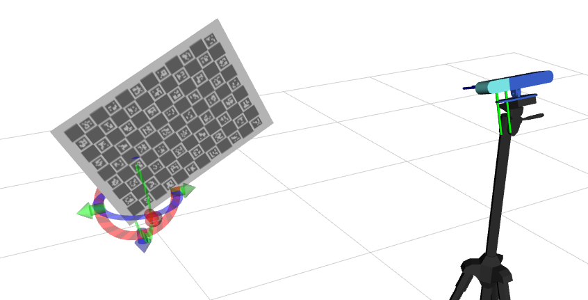
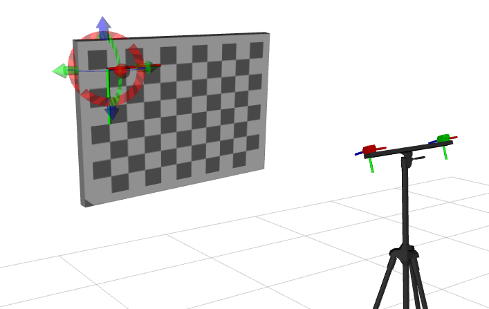
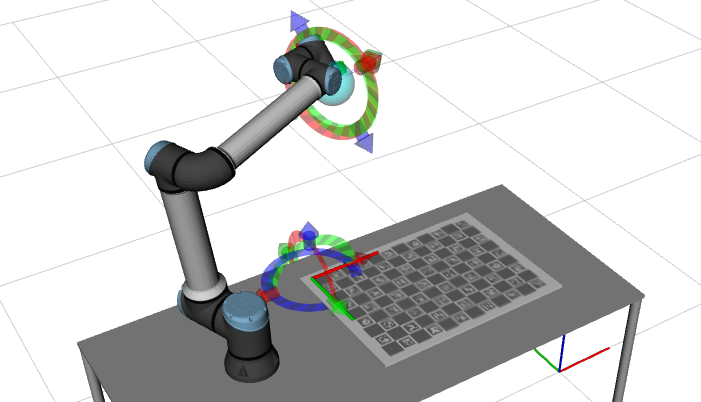
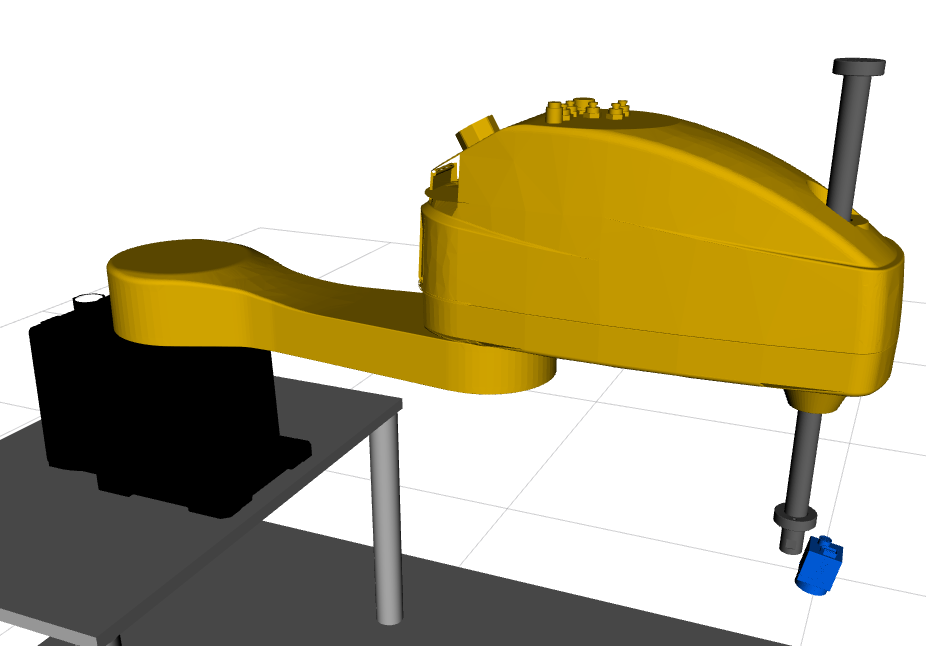
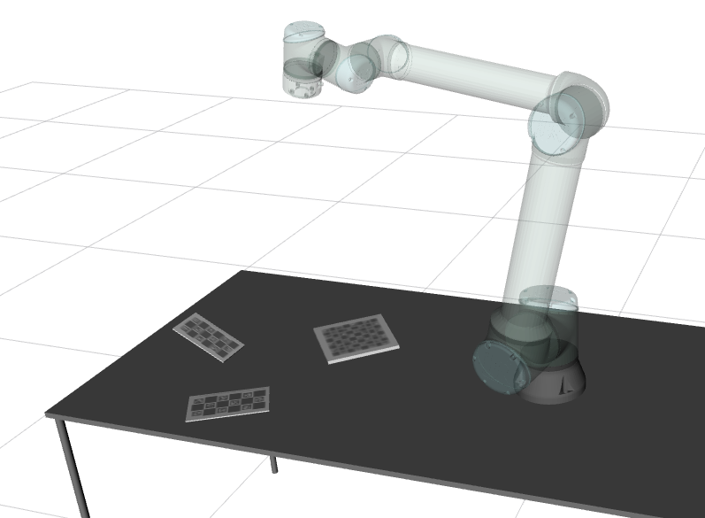
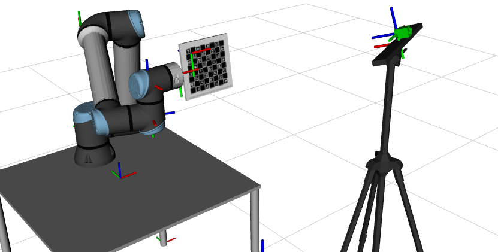

# ATOM_EXAMPLES

ATOM examples are a set of robotic systems which are used to exemplify the capabilities of ATOM. The examples cover several robotic systems, sensor modalities, and calibration configurations.

System |           Name   |   Description
:---:|:---:|:---:
  | [rrbot](rrbot)| **rrbot** (**R**GB **R**GB ro**bot**)  is a simulated system with two rgb cameras mounted on a tripod. The calibration pattern is a Charuco 800x600mm, that moves around the scene.
  | [rdbot](https://github.com/lardemua/atom/tree/noetic-devel/atom_examples/rdbot) | **rdbot** (**R**GB **D**epth ro**bot**) is a simulated system composed of an RGBD camera, i.e., one rgb camera and a depth camera, both mounted on a tripod. Charuco 800x600mm, moving around the scene.
  | [rrcbot](https://github.com/lardemua/atom/tree/noetic-devel/atom_examples/rrcbot) | **rrcbot** (**R**GB **R**GB ro**bot**) Is a simulated system which contains two rgb cameras mounted on a tripod. The pattern is a chessboard 1200x900mm, that moves around the scene.
  | [rihbot](https://github.com/lardemua/atom/tree/noetic-devel/atom_examples/rihbot) | **rihbot** (**R**GB **i**n **w**orld ro**bot**) is a simulated system with an rgb camera mounted on the end-effector of a robotic manipulator. A charuco 800x600mm, is placed on top of the table and does not move. This is often known as a variant of the hand-eye calibration problem called **eye in hand**.
  | [riwbot](https://github.com/lardemua/atom/tree/noetic-devel/atom_examples/riwbot) | **riwbot** (**R**GB **i**n **w**rold ro**bot**) is a simulated system containing an rgb camera mounted on a tripod, facing a robotic manipulator with a pattern attached to the end-effector. A charuco of 200x200mm is attached to the end_effector. This is often known as a variant of the hand-eye calibration problem called **eye in world**.
 | [mrjbot](https://github.com/lardemua/atom/tree/noetic-devel/atom_examples/mrjbot) | **mrjbot** (**m**anipulator with **r**evolute **j**oints ro**bot**) is a simulated system with a configuration in all similar to **rihbot**. The difference here is that the we will also carry out the calibration of joint parameters to calibrate the revolute joints, in addition to the camera pose.
 | [spjbot](https://github.com/lardemua/atom/tree/noetic-devel/atom_examples/spjbot) | **spjbot** (**s**cara **p**rismatic **j**oint ro**bot**) is a simulated system with a configuration often known as SCARA. The goal is to show how ATOM can be used to carry out the calibration of prismatic joints.
 | [rihmpbot](https://github.com/lardemua/atom/tree/noetic-devel/atom_examples/rihmpbot) | **rihmpbot** (**r**gb **i**n **h**and with **m**ultiple **p**attenrs ro**bot**) is a simulated system with a configuration similar to **rihbot**, but in which three different calibration patterns are used simultaneously.
  | [riwmpbot](https://github.com/lardemua/atom/tree/noetic-devel/atom_examples/riwbot) | **riwmpbot** (**R**GB **i**n **w**rold **m**ultiple **p**attern ro**bot**) is a simulated system containing an rgb camera mounted on a tripod, facing a robotic manipulator with several patterns mounted on multiple links.

<!-- Old name | Full new name | acronym
:---:|:---:|:---:
------- | rgb_in_hand_joint_optimization_robot | rihjobot
------- | rgb_in_world_joint_optimization_robot | riwjobot
------- | lidar_robot | lbot
------- | rgb_rgb_multiple_patterns_robot | rmpbot -->

# Download bagfiles and datasets

To download all the bagfiles and datasets required to run the atom examples, use the script:

    rosrun atom_calibration download_atom_examples_data

which puts the bagfiles in the folder defined in your $BAG_FILES environment variable. See the [ATOM documentation](https://lardemua.github.io/atom_documentation/getting_started/#set-environment-variables)

In the specific instructions for each example, the links to download bagfiles and datasets are given. However, **if you downloaded all atom examples data using the above instruction you can ignore those parts**.
