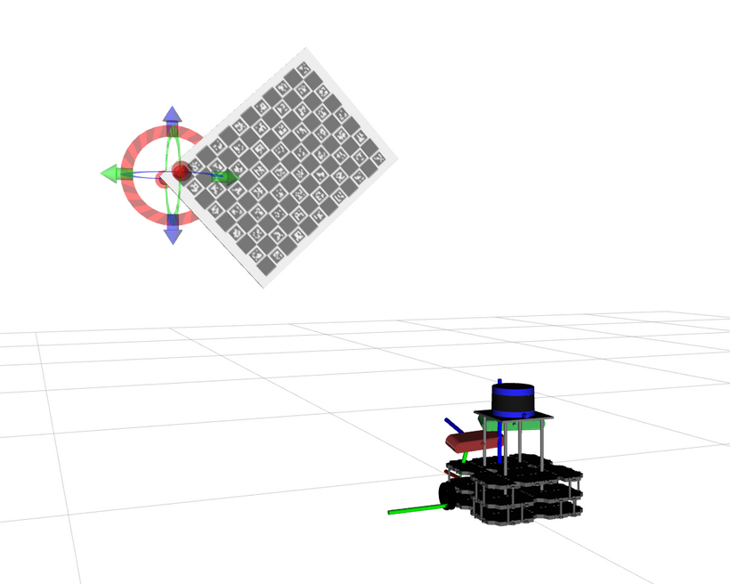

# ATOM_EXAMPLES

ATOM examples are a set of robotic systems which are used to exemplify the capabilities of ATOM. The examples cover several robotic systems, sensor modalities, and calibration configurations.

System |           Name   |   Description
:---:|:---:|:---:
  | [rrbot](rrbot)| Calibration of two RGB sensors.
  | [rdbot](https://github.com/lardemua/atom/tree/noetic-devel/atom_examples/rdbot) | Calibration of an RGB-D sensor.
  | [rrcbot](https://github.com/lardemua/atom/tree/noetic-devel/atom_examples/rrcbot) | Calibration using chessboard patterns.
  | [rihbot](https://github.com/lardemua/atom/tree/noetic-devel/atom_examples/rihbot) | Hand-eye calibration, eye-in-hand variant.
  | [riwbot](https://github.com/lardemua/atom/tree/noetic-devel/atom_examples/riwbot) | Hand-eye calibration, eye-in-world variant.
 | [mrjbot](https://github.com/lardemua/atom/tree/noetic-devel/atom_examples/mrjbot) |  Calibration of revolute joints.
 | [spjbot](https://github.com/lardemua/atom/tree/noetic-devel/atom_examples/spjbot) | Calibration of prismatic joints.
 | [rihmpbot](https://github.com/lardemua/atom/tree/noetic-devel/atom_examples/rihmpbot) | Using multiple calibration patterns.
  | [riwmpbot](https://github.com/lardemua/atom/tree/noetic-devel/atom_examples/riwmpbot) | Improving calibration with multiple patterns.
  | [softbot](https://github.com/lardemua/atom/tree/noetic-devel/atom_examples/softbot) | Calibrating robotic vehicles

