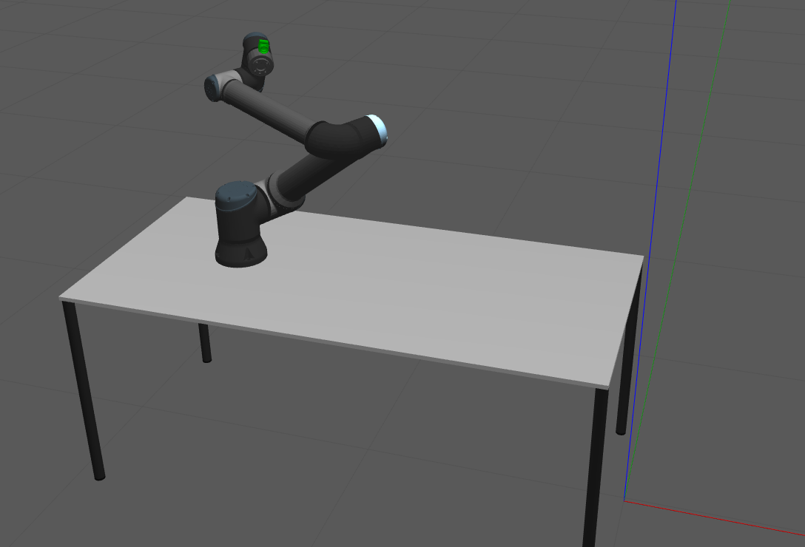

# ATOM_EXAMPLES

ATOM examples are a set of robotic systems which are used to exemplify the capabilities of ATOM. The examples cover several robotic systems, sensor modalities, and calibration configurations.

System |           Name   |   Description
:---:|:---:|:---:
  | [rrbot](rrbot)|**R**GB **R**GB *Ro**bot** is a simulated system with two rgb cameras mounted on a tripod. The calibration pattern is a Charuco 800x600mm, that moves around the scene.
  | [rdbot](https://github.com/lardemua/atom/tree/noetic-devel/atom_examples/rdbot) |An RGBD camera, i.e., one rgb camera and a depth camera, both mounted on a tripod. Charuco 800x600mm, moving around the scene.
  | [rrcbot](https://github.com/lardemua/atom/tree/noetic-devel/atom_examples/rrcbot) | Two rgb cameras mounted on a tripod. Chessboard 1200x900mm, moving around the scene.
  | [rgb_hand_eye_system](https://github.com/lardemua/atom/tree/noetic-devel/atom_examples/rgb_hand_eye_system) | An rgb camera mounted on the end-effector of a robotic manipulator. Charuco 800x600mm, static on top of table.
  | [eye_in_world_system](https://drive.google.com/file/d/1uh4TjKMwsrK8L6OX9dyneeQFAPJDe1Yy/view?usp=drive_link) | An rgb camera mounted on a tripod, facing a robotic manipulator with a pattern attached to the end-effector. Charuco 200x200mm, static mounted on the end_effector.

Old name | Full new name | acronym
:---:|:---:|:---:
rrbot | rgb_rgb_robot | rrbot
rdbot |rgb_depth_robot | rdbot
rrbot_chessboard | rgb_rgb_chessboard_robot | rrcbot
rgb_hand_eye_system | rgb_in_hand_robot | rihbot
eye_in_world_system | rgb_in_world_robot | riwbot
------- | rgb_in_hand_joint_optimization_robot | rihjobot
------- | rgb_in_world_joint_optimization_robot | riwjobot
------- | lidar_robot | lbot
------- | rgb_lidar_robot | rlbot
------- | rgb_multiple_patterns_robot | rmpbot

# Download bagfiles and datasets

To download all the bagfiles and datasets required to run the atom examples, use the script:

    rosrun atom_calibration download_atom_examples_data

which puts the bagfiles in the folder defined in your $BAG_FILES environment variable. See the [ATOM documentation](https://lardemua.github.io/atom_documentation/getting_started/#set-environment-variables)

In the specific instructions for each example, the links to download bagfiles and datasets are given. However, **if you downloaded all atom examples data using the above instruction you can ignore those parts**.
