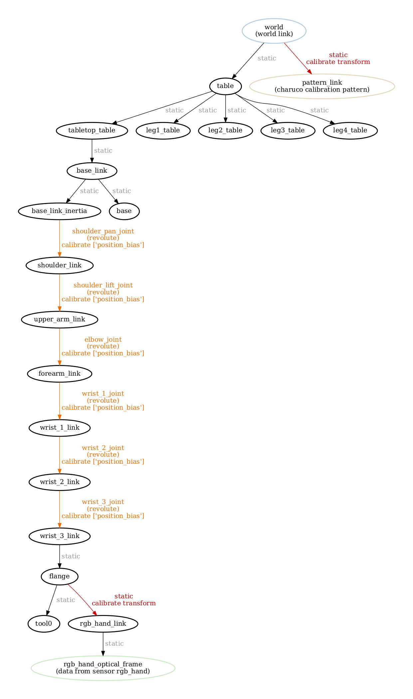
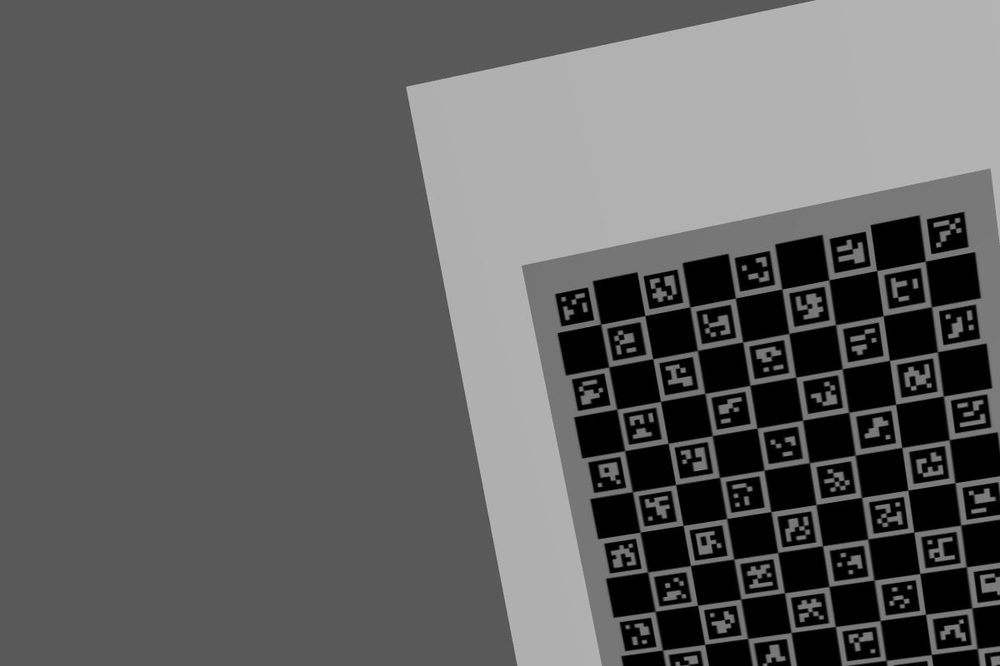
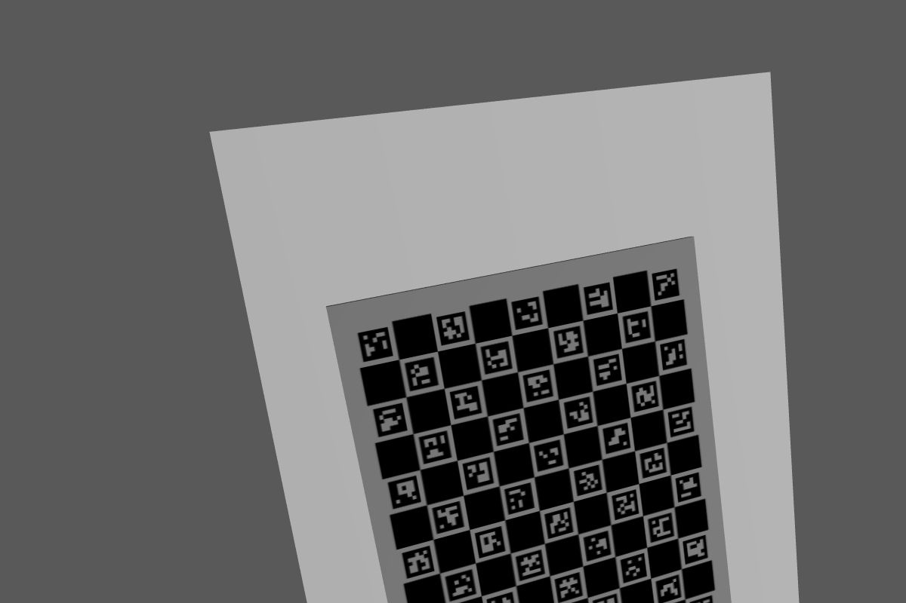
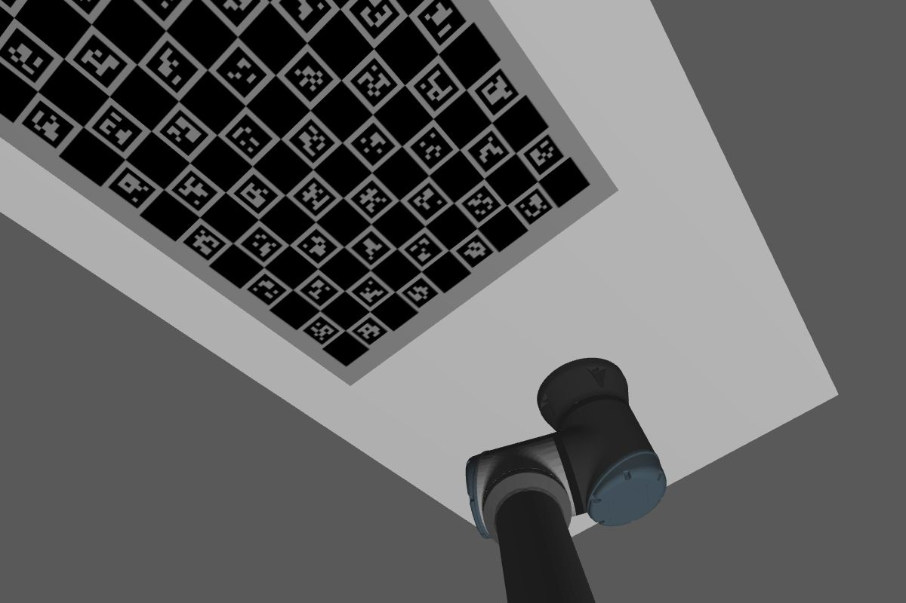
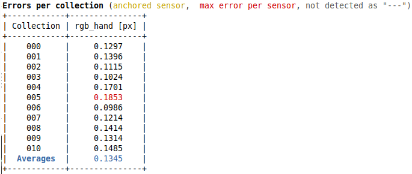

# JCPBBOT

The **j**oint **c**alibration **p**osition **b**ias (**jcpbbot**) is a robotic system used to exemplify joint calibrations in ATOM.
The goal of this system is to show how ATOM may be configured to calibrate the joints in a robotic system.
In this case, only the position bias parameter of the joints is considered. These are the errors produced by offsets in the rotational or linear encoders.

The configuration of the system is exactly the same as the [rihbot](https://github.com/lardemua/atom/tree/noetic-devel/atom_examples/rihbot), including the elements in the scene, the positioning of sensors, and the ros topics, which is why we will not specify these here.

# How to run

First launch the gazebo simulation:

    roslaunch jcpbbot_gazebo gazebo.launch

Then you can bringup the system:

    roslaunch jcpbbot_bringup bringup.launch

You can record a bag file using:

    roslaunch jcpbbot_bringup record.launch

This will put the bag file into your \$ROS_BAGS folder. You should move it to the **$ROS_BAGS/jcpb** folder.

# Calibration

As always, we recommend a careful reading of the [documentation](https://lardemua.github.io/atom_documentation/) to learn all the details.

In this section, out goal is to describe the calibration pipeline for the **jcpbbot**.

To calibrate, we will need a bagfile called [train.bag](https://drive.google.com/file/d/1trvpsJ9W5R0UkSHaOohmr4BZvnXY6ly0/view?usp=drive_link), which contains a recording of the system's data when viewing a calibration pattern in several positions.

Download the bagfile and put it in **$ROS_BAGS/jcpbbot/train.bag**.

## Adding a bias to the joints in the bagfile

The instructions in [How to Run](#how-to-run) will produce a bagfile that will contain joint values in the **/joint_states** message topic. Since these are produced by a simulation, the values will be perfect. To test the calibration of joint bias, we need to insert some bias to disrupt those perfect measurements, using the following command:

    rosrun atom_calibration add_noise_to_joint_state_in_bag -bfi $ROS_BAGS/jcpbbot/train.bag -bfo $ROS_BAGS/jcpbbot/train_with_noise.bag -jn shoulder_lift_joint elbow_joint wrist_1_joint wrist_2_joint wrist_3_joint shoulder_pan_joint -jb 0.034 -0.03 0.05 0.01 -0.03 -0.01

which means we are introducing a bias in the joints values recorded in the bag as follows:

Joint name | Inserted bias (degrees)
:---:|:---:
shoulder_lift_joint | 1.95
elbow_joint | -1.72
wrist_1_joint | 2.87
wrist_2_joint | 0.57
wrist_3_joint | -1.72
shoulder_pan_joint |-0.57

These are errors of non-neglectable magnitude, which should present a challenge for the calibration.

You can download [train_with_noise.bag](https://drive.google.com/file/d/19xjwTXsZkcx5NNL_K3OPWv_Dv6El9ym0/view?usp=sharing) if you wish to skip this step.

We can now move forward to the configuration of the calibration package.

## Creating a calibration package

Using ATOM conventions, we define name of the calibration package as **jcpbbot_calibration**, and create it using:

    rosrun atom_calibration create_calibration_pkg --name jcpbbot_calibration

**NOTE**: This procedure is carried out only once, and was done already. As such, this ros package is already [included in the atom repo](https://github.com/lardemua/atom/tree/noetic-devel/atom_examples/jcpbbot/jcpbbot_calibration). Therefore, you **should not execute this instruction** for the jcpbbot.

## Configuring the calibration

This is the [config.yml](https://github.com/lardemua/atom/blob/noetic-devel/atom_examples/jcpbbot/jcpbbot_calibration/calibration/config.yml) that we wrote to define the calibration. There is a single sensor to be calibrated, named **rgb_hand**. The pattern is a charuco marker.

To configure run:

    rosrun jcpbbot_calibration configure

Which will run a series of checks and produce several files inside the **jcpbbot_calibration** package.

The configuration produces a [visual schematic summarizing](https://github.com/lardemua/atom/blob/noetic-devel/atom_examples/jcpbbot/jcpbbot_calibration/calibration/summary.pdf) the calibration you have setup.

It is advisable to inspect this document carefully to make sure that the calibration is well configured.

## Collecting a dataset

To collect a dataset we run:

    roslaunch jcpbbot_calibration collect_data.launch output_folder:=$ATOM_DATASETS/jcpbbot/dataset1 overwrite:=true

And save a few collections.

We will use as example the [train]() dataset, which contains 11 collections. Some are shown below.

Download and decompress the dataset to **$ATOM_DATASETS/jcpbbot/train**.

Collection |           rgb_hand
:----------------:|:-------------------------:
0 | 
1 | 
2 | 
3 | 

## Running the Calibration

To calibrate, first setup visualization with:

    roslaunch jcpbbot_calibration calibrate.launch

This is useful to visualize the collections stored in the dataset.

Then carry out the actual calibration including noise, using:

    rosrun atom_calibration calibrate -json $ATOM_DATASETS/jcpbbot/train/dataset.json -v -rv -nig 0.1 0.1

This will produce a table of residuals per iteration, like this:

Which starts the calibration with these errors:

which are quite high, because of the incorrect pose of the sensors,  and ends up converging into these figures:

Which shows subpixel accuracy. This means the procedure achieved a successful calibration.

During calibration We can see all collections in the system and, as the calibration progresses, the estimated transformations will be applied to the visualization. The table below shows the positioning of the **rgb_hand** sensor before the calibration starts (using nig 0.1 0.1), and after the calibration is carried out.

View |           Before calibration             |           After calibration
:----------------:|:-------------------------:|:-------------------------:
All collections |  |  
Collection 0 |  |  
Collection 0 (top view)|  |  

## Evaluation

From the [test](https://drive.google.com/file/d/1iKMODjk2m37TBB3tWavJfZlKlwx-WHWz/view?usp=sharing) bagfile, we collected a test dataset.

The evaluation be conducted with a second dataset which has not been seen during calibration. We call these the test datasets.

Download the [test](https://drive.google.com/file/d/16Vi6xo6kt2wEeFBWbTGrZdOL8DmT5ztt/view?usp=sharing) dataset, and decompress to **$ATOM_DATASETS/jcpbbot/test**.

Then, carry out the evaluation using:

    roslaunch jcpbbot_calibration full_evaluation.launch test_json:=$ATOM_DATASETS/jcpbbot/test/dataset.json train_json:=$ATOM_DATASETS/jcpbbot/train/atom_calibration.json

Since we have a single sensor, we do not have reprojection errors. The error w.r.t. the ground truth is:

which shows sub-millimeter accuracy.