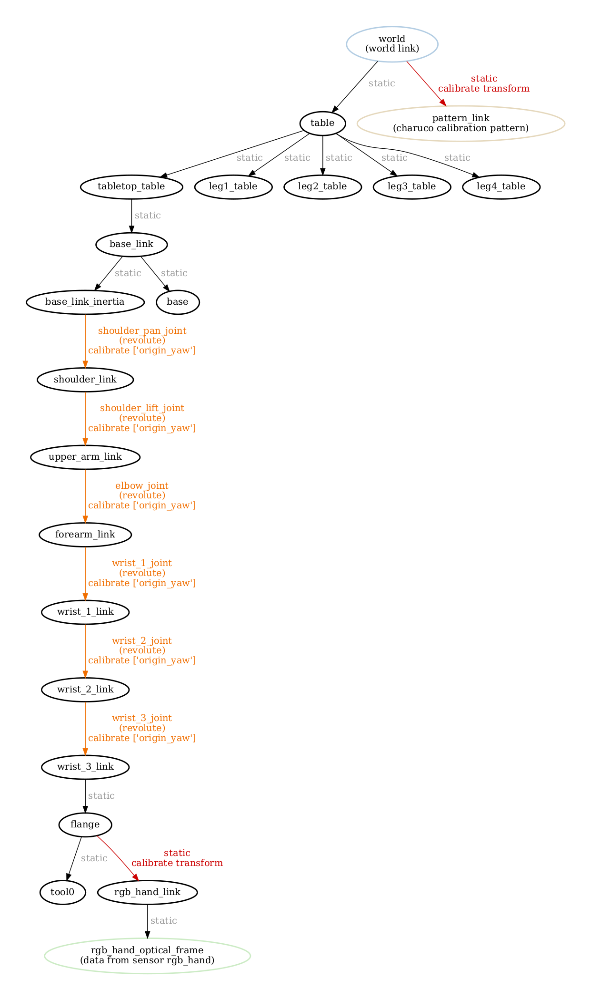
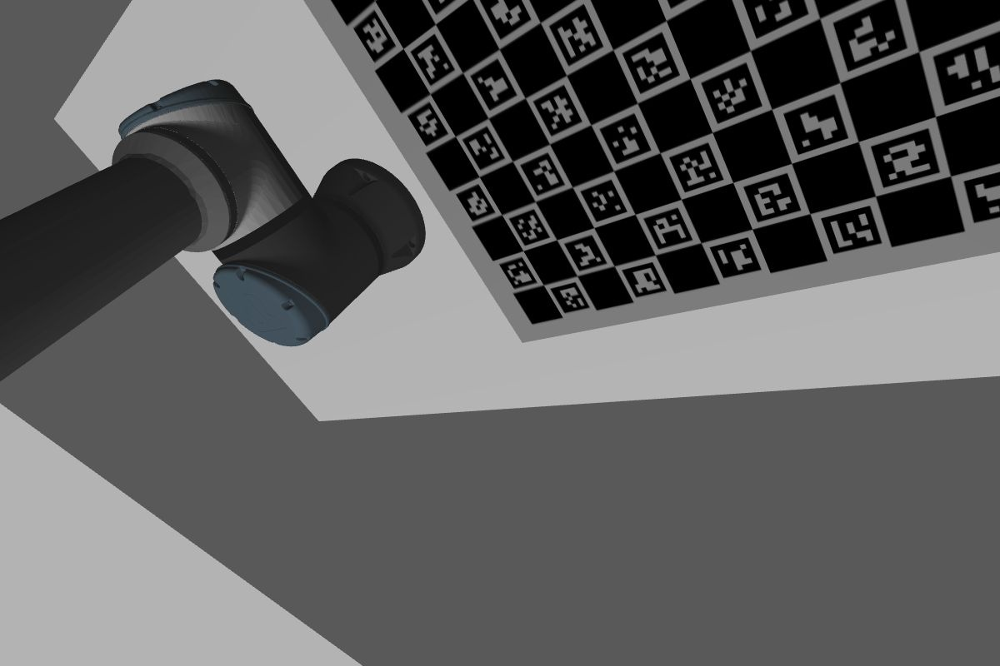
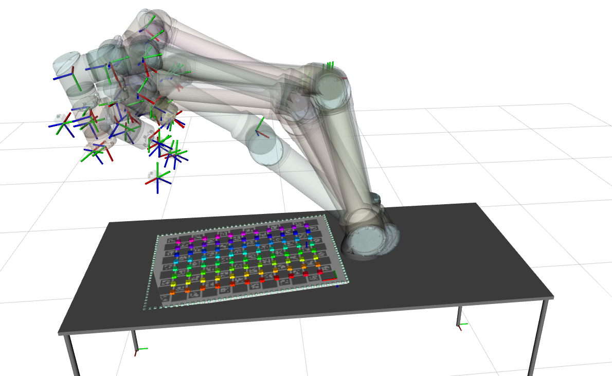

# MRJBOT

The **m**anipulator with **r**evolute **j**oints ro**bot** (**mrjbot**) is a robotic system used to exemplify joint calibrations in ATOM. The goal of this system is to show how ATOM may be configured to calibrate the joints in a robotic system. In this case, only the origin_yaw parameter of the joints is considered. These are the errors produced by offsets in the rotational or linear encoders.

The configuration of the system is exactly the same as the [rihbot](https://github.com/lardemua/atom/tree/noetic-devel/atom_examples/rihbot), including the elements in the scene, the positioning of sensors, and the ros topics, which is why we will not specify these here.

# How to run

First launch the gazebo simulation:

    roslaunch mrjbot_gazebo gazebo.launch

Then you can bringup the system:

    roslaunch mrjbot_bringup bringup.launch

You can record a bag file using:

    roslaunch mrjbot_bringup record.launch

This will put the bag file into your \$ROS_BAGS folder. You should move it to the **$ROS_BAGS/jcpb** folder.

# Calibration

As always, we recommend a careful reading of the [documentation](https://lardemua.github.io/atom_documentation/) to learn all the details.

In this section, out goal is to describe the calibration pipeline for the **mrjbot**.

To calibrate, we will need a bagfile called [train.bag](https://gofile.me/7nlMj/byL8M7tjj), which contains a recording of the system's data when viewing a calibration pattern in several positions.

Download the bagfile and put it in **$ROS_BAGS/mrjbot/train.bag**.

## Creating a calibration package

Using ATOM conventions, we define name of the calibration package as **mrjbot_calibration**, and create it using:

    rosrun atom_calibration create_calibration_pkg --name mrjbot_calibration

**NOTE**: This procedure is carried out only once, and was done already. As such, this ros package is already [included in the atom repo](https://github.com/lardemua/atom/tree/noetic-devel/atom_examples/mrjbot/mrjbot_calibration). Therefore, you **should not execute this instruction** for the mrjbot.

## Configuring the calibration

This is the [config.yml](https://github.com/lardemua/atom/blob/noetic-devel/atom_examples/mrjbot/mrjbot_calibration/calibration/config.yml) that we wrote to define the calibration. There is a single sensor to be calibrated, named **rgb_hand**.

To configure run:

    rosrun mrjbot_calibration configure

Which will run a series of checks and produce several files inside the **mrjbot_calibration** package.

The configuration produces a [visual schematic summarizing](https://github.com/lardemua/atom/blob/noetic-devel/atom_examples/mrjbot/mrjbot_calibration/calibration/summary.pdf) the calibration you have setup.

As we can see the calibration configuration will estimate the parameters of a complete static transformation, from **flange** to **rgb_hand_link**. These are the parameters that will position the rgb_hand sensor w.r.t. the end effector of the robotic manipulator. This component is a classical eye-in-hand calibration, as discussed in the [rihbot](https://github.com/lardemua/atom/tree/noetic-devel/atom_examples/rihbot) example.

The novelty here is the addition of the joint parameter **origin_yaw** to all of the arm's joints. Note that the kinematics of the arm is configured in such a way that the revolute joint motors produce a rotation about the z axis. This is the reason why we always used the parameter **origin_yaw**.

Finally, the system will use a single calibration pattern, a charuco which is static in the scene.

## Collecting a dataset

To collect a dataset we run:

    roslaunch mrjbot_calibration collect_data.launch output_folder:=$ATOM_DATASETS/mrjbot/dataset1 overwrite:=true

And save a few collections.

We will use as example the [train](https://gofile.me/7nlMj/Rd22v8b25) dataset, which was created using the train_with_noise bagfile and thus contains joint position errors. The dataset contains 11 collections. Some are shown below.

Download and decompress the dataset to **$ATOM_DATASETS/mrjbot/train**.

Collection |           rgb_hand
:----------------:|:-------------------------:
0 | 
1 | 
7 | 
8 | 

## Running the Calibration

To calibrate, first setup visualization with:

    roslaunch mrjbot_calibration calibrate.launch

This is useful to visualize the collections stored in the dataset. Here you can see a visual representation of all collections and the corresponding camera at the start of the optimization.

Carry out the actual calibration including noise in the joints using the -jbn and -jbv arguments, using:

    rosrun atom_calibration calibrate -json $ATOM_DATASETS/mrjbot/train/dataset.json \
    -v -rv -nig 0.1 0.1 --phased -pp \
    -jbn shoulder_pan_joint shoulder_lift_joint elbow_joint wrist_1_joint wrist_2_joint wrist_3_joint \
    -jbp origin_yaw origin_yaw origin_yaw origin_yaw origin_yaw origin_yaw \
    -jbv -0.01 0.034 -0.03 0.05 0.01 -0.03

The **--phased** flag will make the optimization halt before starting to change the parameters. With it it is possible to see the visual representation of the initial values of the parameters.
Because we used the nig flag, zooming into a single collection shows the camera is misplaced.

During calibration, the script will produce a table of residuals per iteration which starts the calibration with these errors:

which are quite high, because of the incorrect pose of the sensors,  and ends up converging into these figures:

Which shows subpixel accuracy. This means the procedure achieved a successful calibration.

After calibration, the same collection shows the camera in place:

Moreover, because we used the **--print_parameters** (-pp) flag, the script will print, at the end of the optimization, the estimated values of the calibrated parameters.
The following table shows the estimated parameters vs the imposed biases.

Joint name | Inserted bias (rad) | Estimated bias (rad)
:---:|:---:|:---:
shoulder_pan_joint |-0.01 | 0.0013
shoulder_lift_joint | 0.034 | -0.0367
elbow_joint | -0.03 | 0.0305
wrist_1_joint | 0.05 |0.0499
wrist_2_joint | 0.01 | -0.0102
wrist_3_joint | -0.03 | 0.0815

This shows that the optimization was able to compensate for the errors introduced in the joints, by estimating compensation bias which are very close to corresponding induced errors.
The largest difference between the induced error and the estimated bias occurs in case of the wrist_3_joint, and has a magnitude of just 0.0815 - 0.03 = 0.05 which is below 3 degrees.

