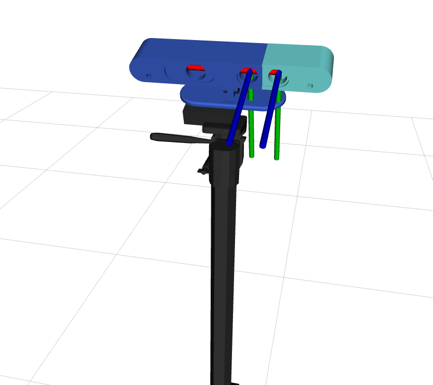
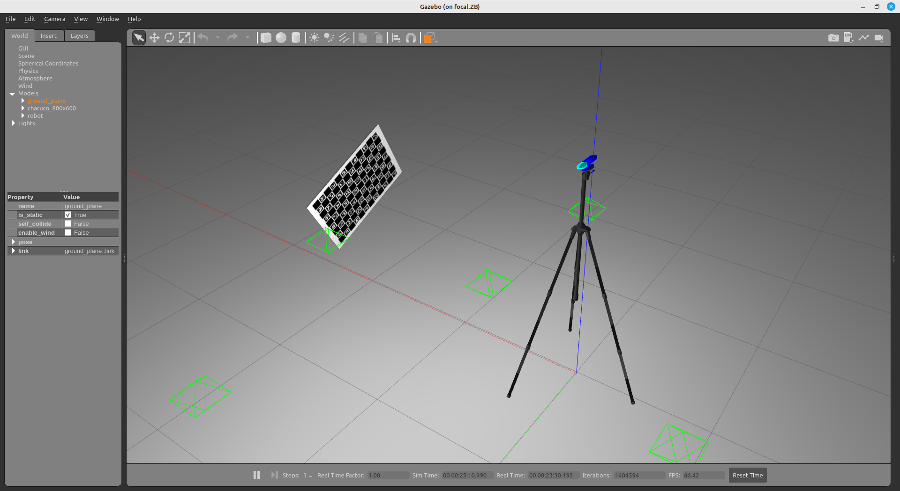
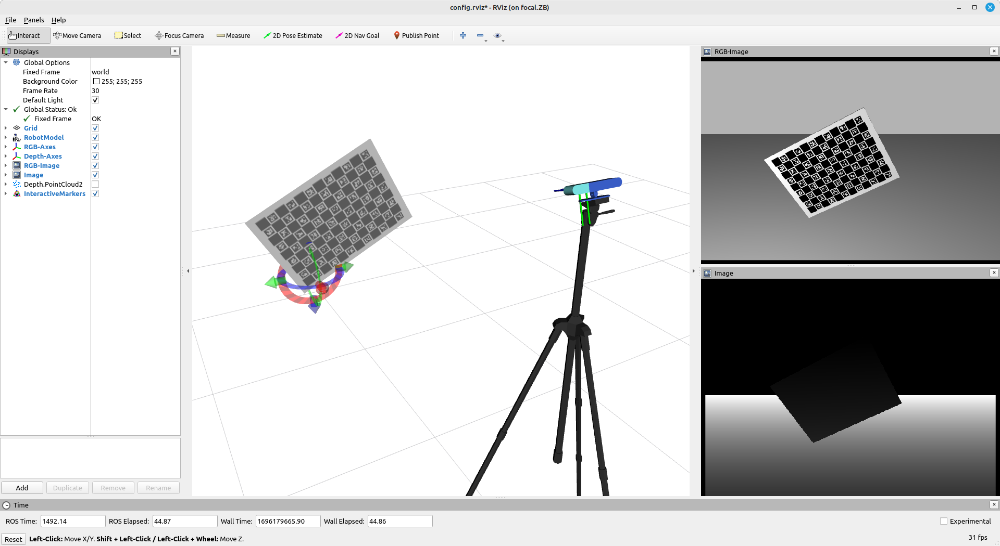
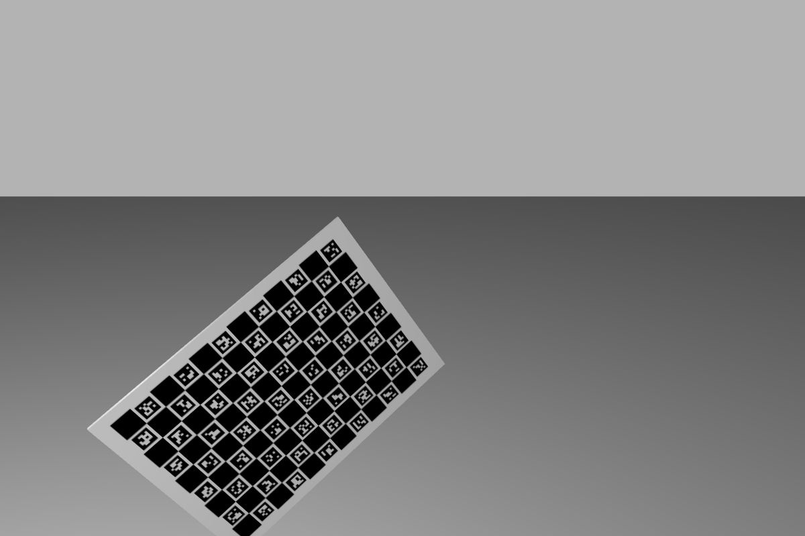
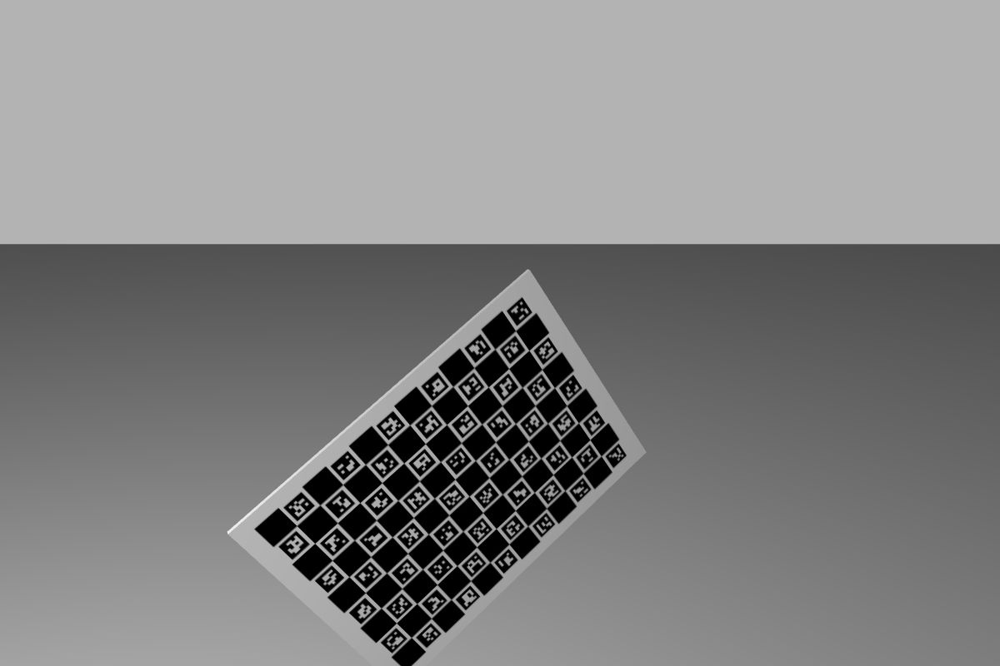
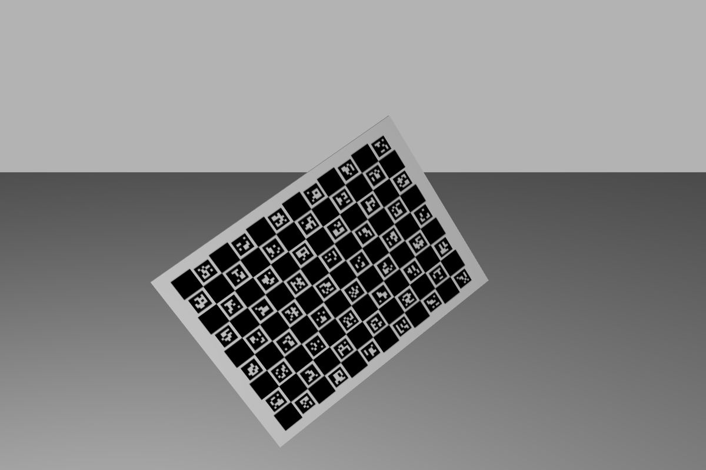
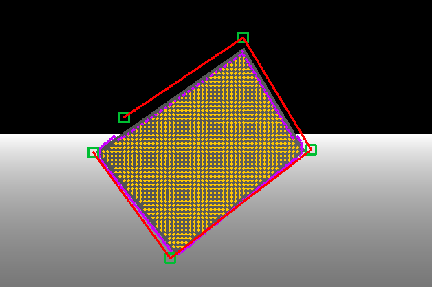
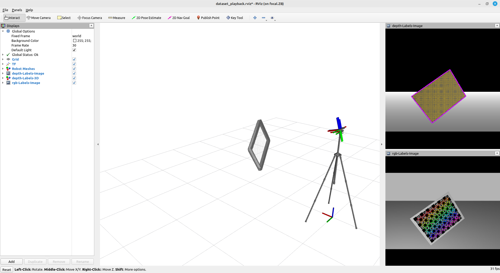
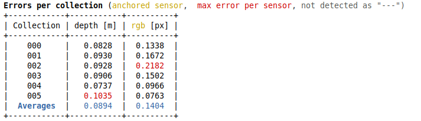
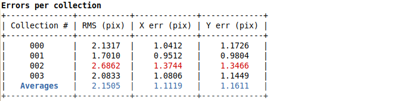

# RGB_DEPTH_SYSTEM

The **rgb_depth_system** is a robotic system meant to be use in simple tests and to serve as example for ATOM beginners.

The system is composed of an rgb-d camera mounted on a tripod.

In ATOM,rgb-d cameras are seen as a device that contains two separate sensors: the **rgb_camera** (in dark blue), and the **depth_camera** (in light blue).
The calibration is carried out considering these are two independent sensors.

The system contains the following topics:

   - /joint_states
   - /rgbd/depth/camera_info
   - /rgbd/depth/image_raw
   - /rgbd/depth/points
   - /rgbd/rgb/camera_info
   - /rgbd/rgb/image_raw
   - /tf
   - /tf_static

Since this is a system designed to test calibration, where frame rate is not a critical issue, we restrained image and point cloud topics to 10Hz.

This is a simulated system, which can be seen in gazebo:

... and in rviz:

# How to run

First launch the gazebo simulation:

    roslaunch rgb_depth_system_gazebo gazebo.launch

Then you can bringup the system:

    roslaunch rgb_depth_system_bringup bringup.launch

You can record a bag file using:

    roslaunch rgb_depth_system_bringup record.launch

This will put the bag file into your $ROS_BAGS folder.

# Calibration

The calibration of any robotic system using **ATOM** may have several variants. We recommend a careful reading of the [documentation](https://lardemua.github.io/atom_documentation/) to learn all the details.

In this section, out goal is to carry out the simplest possible calibration pipeline for the **rgb_depth_system**.

To calibrate, we will need a bagfile called [rgb_depth_system_example_bag.bag](https://drive.google.com/file/d/1Z8mSfHqSesCOYEu3Ugx9F3VTpqe7j1gM/view?usp=sharing), which contains a recording of the system's data when viewing a calibration pattern in several positions.
We produced the bagfile by bringing up the system and then recording a bagfile as described above.
This is a medium sized bagfile with 60 seconds / 600MB for demonstration purposes.

Download the bagfile and put it in tour **$ROS_BAGS/rgb_depth_system** folder.

Next we describe each of the steps in the calibration pipeline.

## Creating a calibration package

See also the [generic documentation](https://lardemua.github.io/atom_documentation/procedures/#create-a-calibration-package) on this topic.

Using ATOM conventions, we define name of the calibration package as **rgb_depth_system_calibration**, and create it using:

    rosrun atom_calibration create_calibration_pkg --name rgb_depth_system_calibration

**NOTE**: This procedure is carried out only once, and was done already. As such, this ros package is already [included in the atom repo](https://github.com/lardemua/atom/tree/noetic-devel/atom_examples/rgb_depth_system/rgb_depth_system_calibration). Therefore, you **should not execute this instruction** for the rgb_depth_system.

## Configuring the calibration

This is the [config.yml](https://github.com/lardemua/atom/blob/noetic-devel/atom_examples/rgb_depth_system/rgb_depth_system_calibration/calibration/config.yml) that we wrote to define the calibration. There are two sensors to be calibrated, named **rgb** and **depth**. The pattern is a charuco marker.
The configuration file points to the bagfile mentioned above, and the _anchored_sensor_ is defined as the **rgb** sensor.

To configure run:

    rosrun rgb_depth_system_calibration configure

Which will run a series of checks and produce several files inside the **rgb_depth_system_calibration** package.

## Collecting a dataset

To collect a dataset we run:

    roslaunch rgb_rgb_system_calibration collect_data.launch output_folder:=$ATOM_DATASETS/rgb_depth_system/dataset1 overwrite:=true

And save a few collections.

We will use as example the [train](https://drive.google.com/file/d/19MNEF-cDy-_YsI21oHDPrcEiZ8VTGTKh/view?usp=sharing) dataset, which contains 4 collections, as shown bellow.

Download and decompress the dataset to **$ATOM_DATASETS/rgb_depth_system/train**:

    export DP=$ATOM_DATASETS/rgb_depth_system && wget --no-check-certificate 'https://docs.google.com/uc?export=download&id=19MNEF-cDy-_YsI21oHDPrcEiZ8VTGTKh' -O $DP/train.zip && unzip $DP/train.zip && rm $DP/train.zip

Collection |           rgb             |           depth
:----------------:|:-------------------------:|:-------------------------:
0 |  |  
1 |  |  
2 |  |  
3 |  |  
4 |  |  
5 |  |  

## Using dataset playback to verify the labels

In ATOM, typically RGB sensors are very accurately auto-labeled, but for other modalities one should verify if the labels generated automatically during the dataset collection stage are correct.
This is done using the dataset playback functionality.

Since the **rgb_depth_system** contains a depth sensor, we are going to run dataset playback without before running calibration. First launch the visualization:

    roslaunch rgb_depth_system_calibration dataset_playback.launch

and then the dataset playback node:

    rosrun atom_calibration dataset_playback -json $ATOM_DATASETS/rgb_depth_system/train/dataset.json -ow

We can use the left / right arrow keys to move between collections.

Move on to ***collection 004**. You should see this:

in the 3D you can see small grey points. These are the points that were labeled as belonging to the pattern. Then you can see larger cubes, which are points annotated as belonging to the boundary of the pattern. The latter are clearly incorrectly labeled as we can see in the 3D window that some of these points are on the floor, instead of being on the boundary of the pattern.

To fix this we will use the manual correction of depth data. Draw a polygon around the pattern as shown in the image below:

once you close the polygon, i.e., click a point close to the initial point, a labeling procedure will start using the user defined polygon as input (which may take several seconds).
The result of this manual labeling is the following:

which now should a very accurate labeling of the boundaries of the pattern.

This procedure should be carried out for all collections in the dataset. The dataset playback produces a corrected dataset. You can use the **dataset_corrected.json** file contained in the [rgb_depth_system_example_train_dataset](https://drive.google.com/file/d/19MNEF-cDy-_YsI21oHDPrcEiZ8VTGTKh/view?usp=sharing) you downloaded before.

## Running the Calibration

To calibrate, first setup visualization with:

    roslaunch rgb_depth_system_calibration calibrate.launch

Then carry out the actual calibration, remembering to point to the corrected dataset and to add some noise (nig):

    rosrun atom_calibration calibrate -json $ATOM_DATASETS/rgb_depth_system/train/dataset_corrected.json -v -rv -nig 0.1 0.1

Which starts the calibration with these errors:

which are high. Notice the average error for depth is 0.0894 meters, which corresponds to 8 centimeters.
Once the calibration is complete, results are:

Which shows subpixel accuracy for the rgb camera and half centimeter for the depth camera.

## Evaluation

The evaluation be conducted with a second dataset which has not been seen during calibration. We call these the test datasets.

##### Download and verification of Test dataset

Download the [rgb_depth_system_example_test_dataset](https://drive.google.com/file/d/1ziKR0kAoJPa6bSUF6akUSTC4LcU6Pe9-/view?usp=sharing) and decompress to **$ATOM_DATASETS/rgb_depth_system/rgb_depth_system_example_test_dataset**.
We recommend that the labels in test dataset are also verified using the dataset playback:

    roslaunch rgb_depth_system_calibration dataset_playback.launch

and then:

    rosrun atom_calibration dataset_playback -json $ATOM_DATASETS/rgb_depth_system/rgb_depth_system_example_test_dataset/dataset.json -ow

##### Manual annotation of pattern's boundaries in the rgb image

To run the evaluation of the depth to rgb sensor, we will also need to manually annotate the ground truth pattern boundaries on the rgb images. Do this by calling:

    rosrun atom_evaluation annotate_pattern_borders_in_rgb_or_depth --dataset /home/mike/datasets/rgb_depth_system/rgb_depth_system_example_test_dataset/dataset.json --rgb_sensor rgb

This is the image annotation tool from ATOM. You can press "h" for help. All collections should be annotated as exemplified below:

This procedure produces a files called **annotation_\<sensor name\>.json**, i.e. **annotation_rgb.json**. This file is already included in the test dataset, so you may skip these steps if you wish to do so.

##### Evaluation script

Finally, the evaluation of the calibration is run with:

    roslaunch rgb_depth_system_calibration full_evaluation.launch test_json:=$ATOM_DATASETS/rgb_depth_system/rgb_depth_system_example_test_dataset/dataset_corrected.json train_json:=$ATOM_DATASETS/rgb_depth_system/rgb_depth_system_example_train_dataset/atom_calibration.json

which results in:

