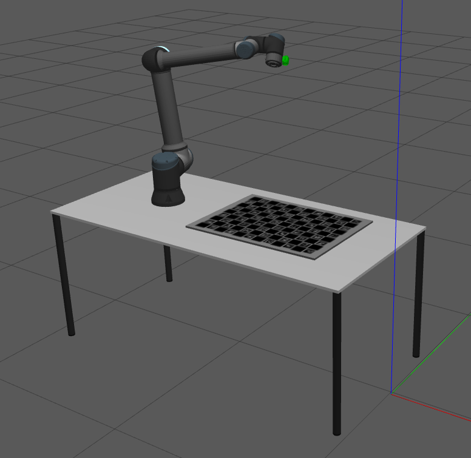
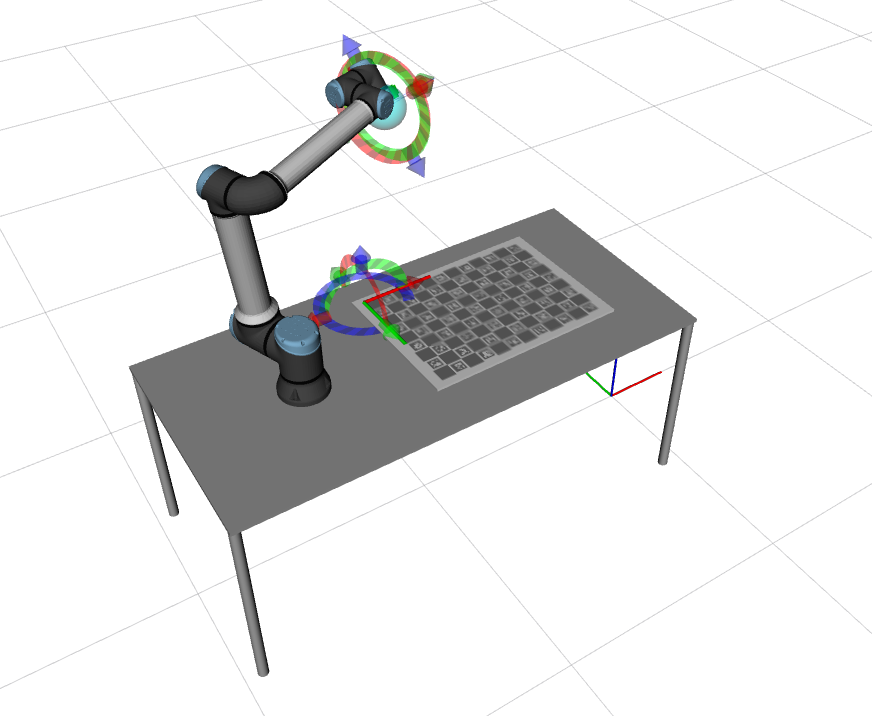

# RGB_HAND_EYE_SYSTEM

The **rgb_hand_eye_system** is a robotic system used to evaluate hand eye calibrations in ATOM.

The system is composed of one rgb camera mounted on the end effector of a robotic manipulator.
The camera is called **rgb_hand** (green).
The system contains the following topics:

  - /rgb_hand/camera_info
  - /rgb_hand/image_raw
  - /tf
  - /tf_static

Since this is a systems to test calibration, where frame rate is not a critical issue, we restrained images topics to 10Hz.
This is a simulated system, which can be seen in gazebo:

... and in rviz:

# How to run

First launch the gazebo simulation:

    roslaunch rgb_hand_eye_system_gazebo gazebo.launch

Then you can bringup the system:

    roslaunch rgb_hand_eye_system_bringup bringup.launch

You can record a bag file using:

    roslaunch rgb_hand_eye_system_bringup record.launch

This will put the bag file into your $ROS_BAGS folder.

# Calibration

The calibration of any robotic system using **ATOM** may have several variants. We recommend a careful reading of the [documentation](https://lardemua.github.io/atom_documentation/) to learn all the details.

In this section, out goal is to carry out the simplest possible calibration pipeline for the **rgb_hand_eye_system**.

To calibrate, we will need a bagfile called [rgb_hand_eye_system_example_bag.bag](https://drive.google.com/file/d/1Noo3eZh72m-xRobYZywdo1wtqg7e4wGa/view?usp=sharing), which contains a recording of the system's data when viewing a calibration pattern in several positions.
We produced the bagfile by bringing up the system and then recording a bagfile as described above.
This is a small bagfile with 40 seconds / 60MB for demonstration purposes. Typically, calibration bagfiles are larger.

Download the bagfile and put it in **$ROS_BAGS/rgb_hand_eye_system**.

Next we describe each of the steps in the calibration pipeline.

## Creating a calibration package

See also the [generic documentation](https://lardemua.github.io/atom_documentation/procedures/#create-a-calibration-package) on this topic.

Using ATOM conventions, we define name of the calibration package as **rgb_hand_eye_system_calibration**, and create it using:

    rosrun atom_calibration create_calibration_pkg --name rgb_hand_eye_system_calibration

**NOTE**: This procedure is carried out only once, and was done already. As such, this ros package is already [included in the atom repo](https://github.com/lardemua/atom/tree/noetic-devel/atom_examples/rgb_hand_eye_system/rgb_hand_eye_system_calibration). Therefore, you **should not execute this instruction** for the rgb_hand_eye_system.

## Configuring the calibration

This is the [config.yml](https://github.com/lardemua/atom/blob/miguelriemoliveira/issue629/atom_examples/rgb_hand_eye_system/rgb_hand_eye_system_calibration/calibration/config.yml) that we wrote to define the calibration. There are two sensors to be calibrated, named **rgb_left** and **rgb_right**. The pattern is a charuco marker.
The configuration file points to the bagfile mentioned above, and the _anchored_sensor_ is defined as the **rgb_left** sensor.

To configure run:

    rosrun rgb_hand_eye_system_calibration configure

Which will run a series of checks and produce several files inside the **rgb_hand_eye_system_calibration** package.

## Collecting a dataset

To collect a dataset we run:

    roslaunch rgb_hand_eye_system_calibration collect_data.launch output_folder:=$ATOM_DATASETS/rgb_hand_eye_system/dataset1 overwrite:=true

And save a few collections.

We will use as example the [rgb_hand_eye_system_example_train_dataset](https://drive.google.com/file/d/1FobBsyxtI29hDt5NlKfAg7kFdsZxrcbG/view?usp=sharing), which contains 4 collections, as shown bellow.

Download and decompress the dataset to **$ATOM_DATASETS/rgb_hand_eye_system/rgb_hand_eye_system_example_train_dataset**.

Collection |           rgb_left             |           rgb_right
:----------------:|:-------------------------:|:-------------------------:
0 |  |  
1 |  |  
2 |  |  
3 |  |  

## Running the Calibration

To calibrate, first setup visualization with:

    roslaunch rgb_hand_eye_system_calibration calibrate.launch

Then carry out the actual calibration using:

    rosrun atom_calibration calibrate -json $ATOM_DATASETS/rgb_hand_eye_system/rgb_hand_eye_system_example_dataset/dataset.json -v -rv

This will produce a table of residuals per iteration, like this:

This is the table presented once calibration is complete, which shows average reprojection errors of under 1 pixel. Sub-pixel accuracy is considered a good result for rgb camera calibration.

 Since this is a simulation, the original pose of the cameras is actually the one used by gazebo to produce the images. This means that the cameras are already positioned in the actual ground truth pose, which means that the calibration did not do much in this case. In a real system, the sensors will not be positioned at the ground truth pose. In fact, for real systems, we do not know where the ground truth is.

To make sure this ATOM is actually calibrating sensor poses in simulated experiments, we use the --noise_initial_guess (-nig) flag. This makes the calibrate script add a random variation to the initial pose of the cameras, to be sure they are not located at the ground truth:

    rosrun atom_calibration calibrate -json $ATOM_DATASETS/rgb_hand_eye_system/rgb_hand_eye_system_example_train_dataset/dataset.json -v -rv -nig 0.1 0.1

Which starts the calibration with these errors:

which are quite high, because of the incorrect pose of the sensors,  and ends up converging into these figures:

Which again, have subpixel accuracy. This means the procedure achieved a successful calibration.

## Evaluation

The evaluation be conducted with a second dataset which has not been seen during calibration. We call these the test datasets.

Download the [rgb_hand_eye_system_example_test_dataset](https://drive.google.com/file/d/1AvjQxncY1G0BbCZu_mgYIyefeFztsHpB/view?usp=sharing) and decompress to **$ATOM_DATASETS/rgb_hand_eye_system/rgb_hand_eye_system_example_test_dataset**.

    roslaunch rgb_hand_eye_system_calibration full_evaluation.launch test_json:=$ATOM_DATASETS/rgb_hand_eye_system/rgb_hand_eye_system_example_test_dataset/dataset.json train_json:=$ATOM_DATASETS/rgb_hand_eye_system/rgb_hand_eye_system_example_train_dataset/atom_calibration.json
