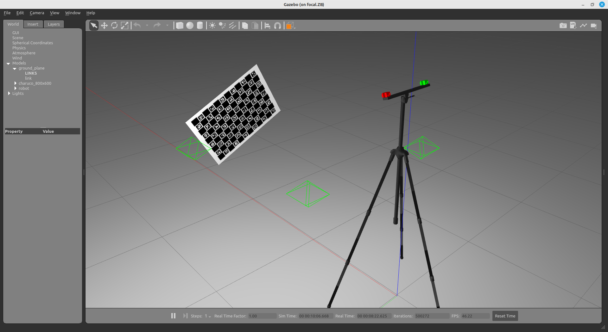
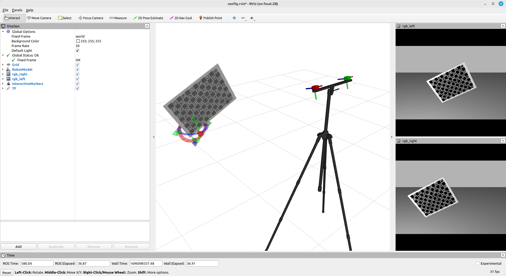

# RGB_RGB_SYSTEM

The **rgb_rgb_system** is a robotic system meant to be use in simple tests and to serve as example for ATOM beginners.


The system is composed of two rgb cameras mounted on a tripod.
Cameras are called **rgb_left** (red) and **rgb_right** (green).
The system contains the following topics:

  - /rgb_left/rgb/camera_info 
  - /rgb_left/rgb/image_raw 
  - /rgb_right/rgb/camera_info
  - /rgb_right/rgb/image_raw 
  - /tf
  - /tf_static

Since this is a systems to test calibration, where frame rate is not a critical issue, we restrained images topics to 10Hz. 
This is a simulated system, which can be seen in gazebo:



... and in rviz:



# How to run

First launch the gazebo simulation:

    roslaunch rgb_rgb_system_gazebo gazebo.launch

Then you can bringup the system:

    roslaunch rgb_rgb_system_bringup bringup.launch

You can record a bag file using:

    roslaunch rgb_rgb_system_bringup record.launch

This will put the bag file into your $ROS_BAGS folder. 

# Calibration 

...

<!-- 
##   Configuring a calibration package
Once your calibration package is created you will have to configure the calibration procedure by editing the softbot_calibration/calibration/config.yml file with your system information. Here is an example of a config.yml file.
    
    rosrun atom_calibration create_calibration_pkg --name softbot_calibration

After filling the config.yml file, you can run the package configuration:

    rosrun atom_calibration configure_calibration_pkg -n softbot_calibration --use_tfs

This will create a set of files for launching the system, configuring rviz, etc.

##  Collect data

To run a system calibration, one requires sensor data collected at different time instants. We refer to these as data collections. To collect data, the user should launch:

    roslaunch softbot_calibration collect_data.launch  output_folder:=~/datasets/softbot/dataset3 overwrite:=true
## Calibrate sensors
finally run an optimization that will calibrate your sensors:

    roslaunch softbot_calibration calibrate.launch dataset_file:=~/datasets/softbot/dataset3/dataset.json run_calibration:=false 

and then launch the script in standalone mode

    rosrun atom_calibration calibrate -json ~/datasets/softbot/dataset3/dataset.json  -phased -rv -v -si
OBS: If needed we can exclude some of the bad collections:

    rosrun atom_calibration calibrate -json ~/datasets/softbot/dataset4/dataset_corrected.json  -phased -rv -v -si -csf "lambda x: int(x) not in [16,21,23,24,34,36]"

It is possible to add an initial guess of the position of the sensors in order to get a more real result

    rosrun atom_calibration calibrate -json ~/datasets/softbot/dataset4/dataset_corrected.json  -phased -rv -v -si -csf "lambda x: int(x) not in [18,24,23] " -nig 0.01  0.003 -ss 3 -ipg

To evaluate the calibration that was done, its need to do the annotation

    rosrun atom_evaluation annotate.py -test_json TEST_JSON_FILE -cs front_left_camera -si -->

# Installation

##### Add to .bashrc:
```
export TURTLEBOT3_MODEL="waffle"
export ROS_BAGS="/home/<username>/bagfiles"
export ATOM_DATASETS="/home/<username>/datasets"
export GAZEBO_MODEL_PATH="`rospack find softbot_gazebo`/models:${GAZEBO_MODEL_PATH}"
```

