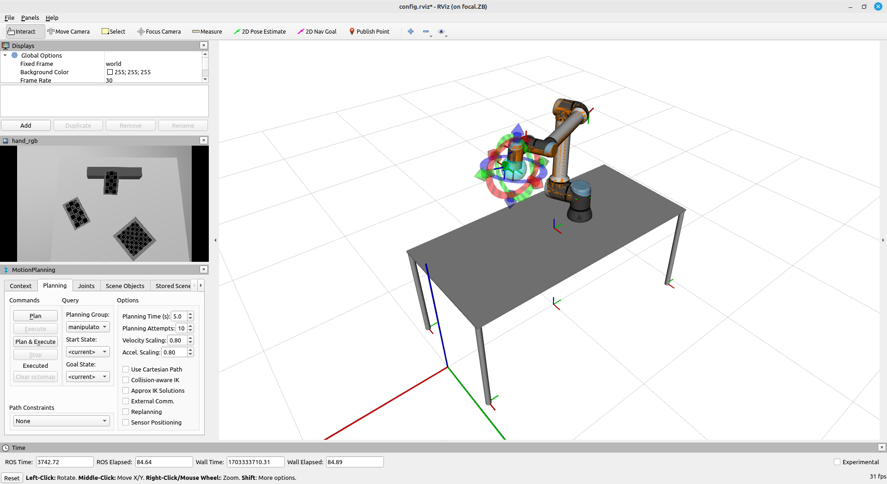
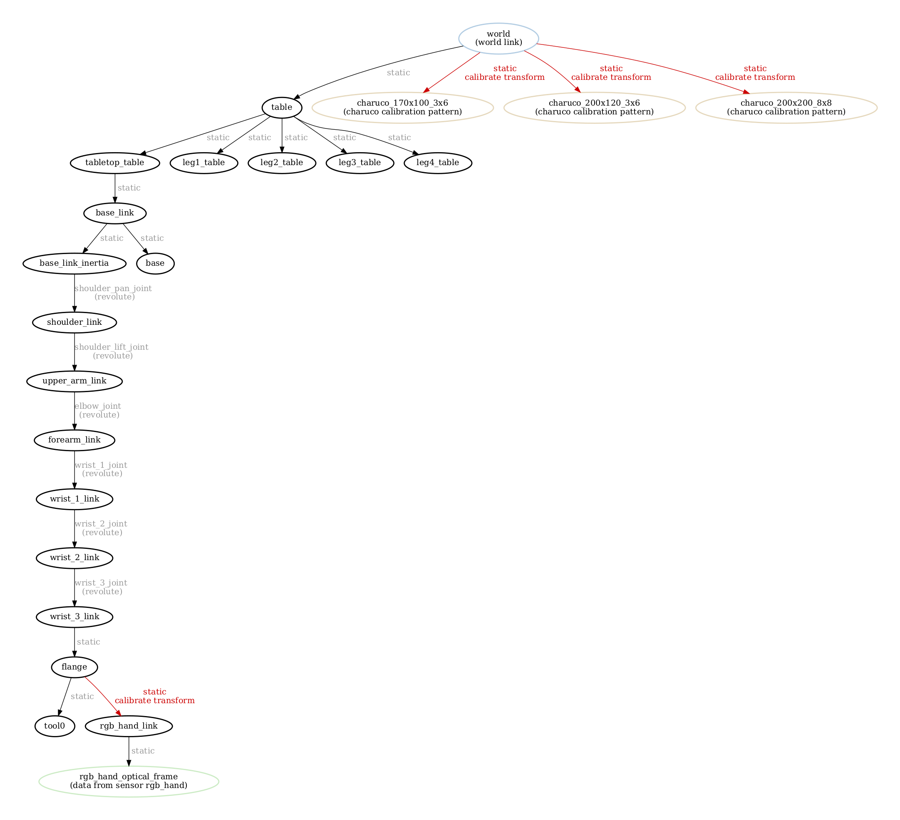
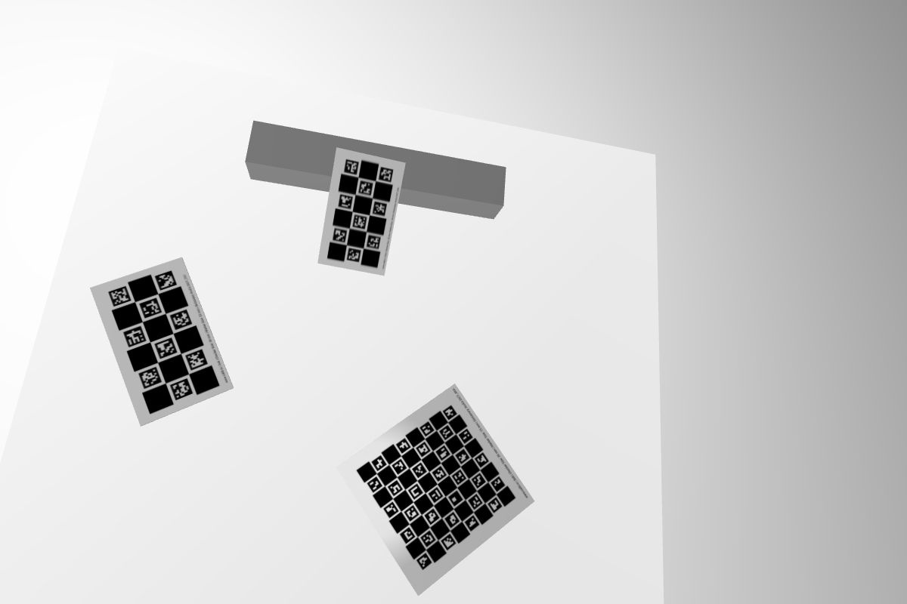
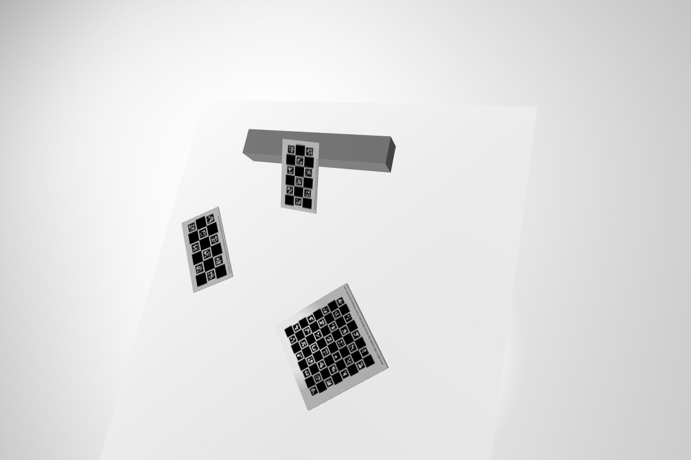
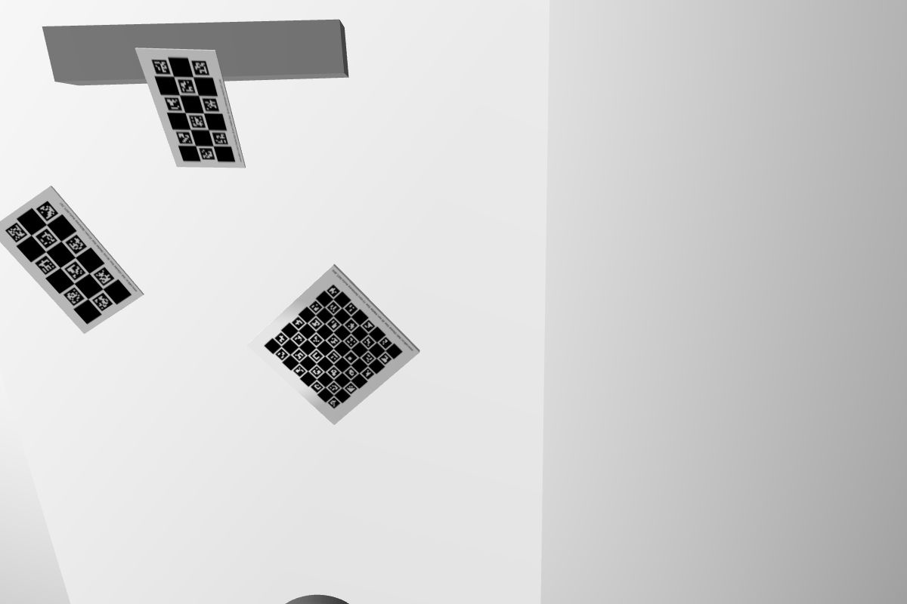
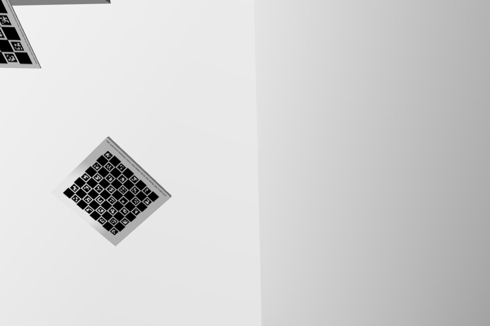
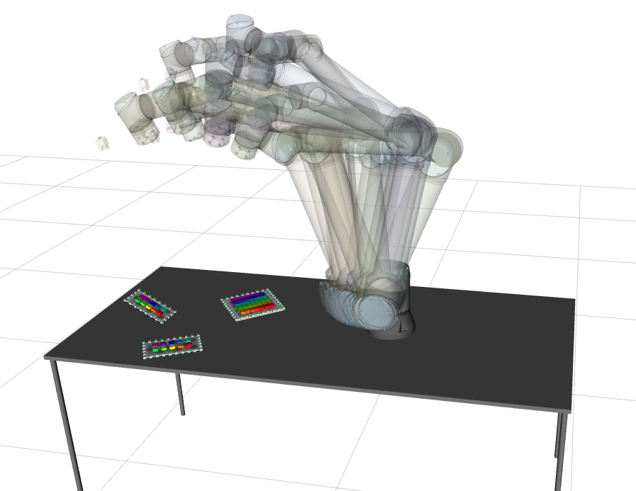
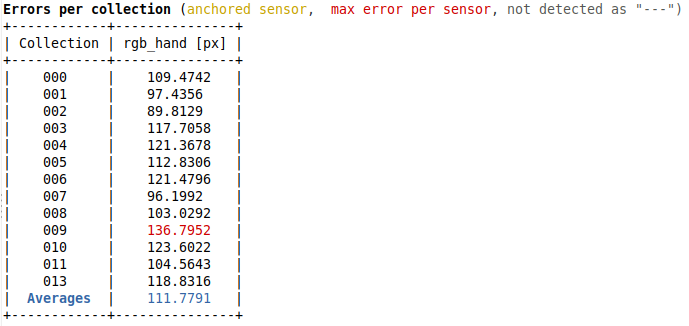
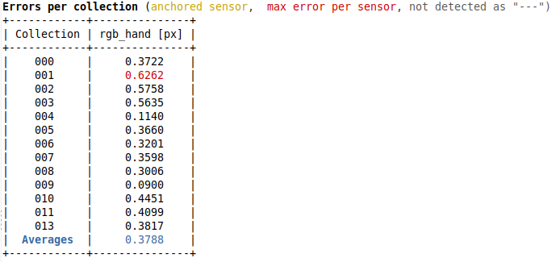

# RIHMPBOT

The **R**GB **i**n **h**and with **m**ultiple **p**atterns ro**bot** (**rihmpbot**) is a simulated robotic system used to test calibrations with multiple patterns in ATOM.

The system contains a single rgb camera mounted on the end effector of a robotic manipulator.
The camera is called **rgb_hand** (green).
The system contains the following topics:

  - /rgb_hand/camera_info
  - /rgb_hand/image_raw
  - /tf
  - /tf_static
  - /joint_states

Since this is a systems to test calibration, where frame rate is not a critical issue, we restrained images topics to 10Hz.

The scene contains 3 static calibration patterns placed on top of the table:

  - charuco, size 170x100 millimeters, corners layout 3x6, aruco dictionary 6x6
  - charuco, size 200x120 millimeters, corners layout 3x6, aruco dictionary 7x7
  - charuco, size 200x200 millimeters, corners layout 8x8, aruco dictionary 4x4

Note that ATOM is able to distinguish between patterns because each pattern has an unique aruco dictionary configuration. If a calibration configuration two patterns with the same aruco dictionary, ATOM calibration package configuration should abort.

This is a simulated system, which can be seen in gazebo, as shown above, and in rviz, as shown next:

# How to run

First launch the gazebo simulation:

    roslaunch rihmpbot_gazebo gazebo.launch

Then you can bringup the system:

    roslaunch rihmpbot_bringup bringup.launch

You can record a bag file using:

    roslaunch rihmpbot_bringup record.launch

This will put the bag file into your $ROS_BAGS folder.

# Calibration

As always, we recommend a careful reading of the [documentation](https://lardemua.github.io/atom_documentation/) to learn all the details.

In this section, out goal is to describe the calibration pipeline for the **rihmpbot**.

To calibrate, we will need a bagfile called [train.bag](https://drive.google.com/file/d/1ryaW0MBhaUYH-kx_hle2ztkzLRCiuuLt/view?usp=sharing), which contains a recording of the system's data when viewing a calibration pattern in several positions.
We produced the bagfile by bringing up the system and then recording a bagfile as described above.

Download the bagfile and put it in **$ROS_BAGS/rihmpbot**.

Next we describe each of the steps in the calibration pipeline.

## Creating a calibration package

See also the [generic documentation](https://lardemua.github.io/atom_documentation/procedures/#create-a-calibration-package) on this topic.

Using ATOM conventions, we define name of the calibration package as **rihmpbot_calibration**, and create it using:

    rosrun atom_calibration create_calibration_pkg --name rihmpbot_calibration

**NOTE**: This procedure is carried out only once, and was done already. As such, this ros package is already [included in the atom repo](https://github.com/lardemua/atom/tree/noetic-devel/atom_examples/rihmpbot/rihmpbot_calibration). Therefore, you **should not execute this instruction** for the rihmpbot.

## Configuring the calibration

This is the [config.yml](https://github.com/lardemua/atom/blob/noetic-devel/atom_examples/rihmpbot/rihmpbot_calibration/calibration/config.yml) that we wrote to define the calibration. There is a single sensor to be calibrated, named **rgb_hand**. As discussed before, we have three charuco patterns.
The configuration file points to the train bagfile mentioned above, and the _anchored_sensor_ is not defined.

To configure run:

    rosrun rihmpbot_calibration configure

Which will run a series of checks and produce several files inside the **rihmpbot_calibration** package.

The configuration produces a [visual schematic summarizing](https://github.com/lardemua/atom/blob/noetic-devel/atom_examples/rihmpbot/rihmpbot_calibration/calibration/summary.pdf) the calibration you have setup.

It is advisable to inspect this document carefully to make sure that the calibration is well configured.

## Collecting a dataset

To collect a dataset we run:

    roslaunch rihmpbot_calibration collect_data.launch output_folder:=$ATOM_DATASETS/rihmpbot/dataset1 overwrite:=true

And save a few collections.

We will use as example the [train](https://drive.google.com/file/d/1PJ-nb-BEBhcB2Nsn4M84ttXWGGQkLySQ/view?usp=sharing) dataset, which contains 14 collections. Some are shown below.

Download and decompress the dataset to **$ATOM_DATASETS/rihmpbot/train**.

Collection |           rgb_hand
:----------------:|:-------------------------:
0 | 
1 | 
9 | 
10 | 

## Running the Calibration

To calibrate, first setup visualization with:

    roslaunch rihmpbot_calibration calibrate.launch

This is useful to visualize the collections stored in the dataset.

Then carry out the actual calibration including noise, using:

    rosrun atom_calibration calibrate -json $ATOM_DATASETS/rihmpbot/train/dataset.json -v -rv -nig 0.1 0.1

This will produce a table of residuals per iteration, like this:

Which starts the calibration with these errors:

which are quite high, because of the incorrect pose of the sensors,  and ends up converging into these figures:

Which shows subpixel accuracy. This means the procedure achieved a successful calibration.

