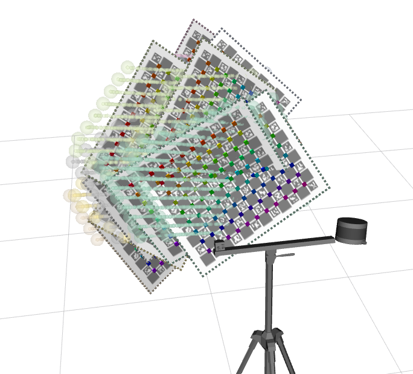
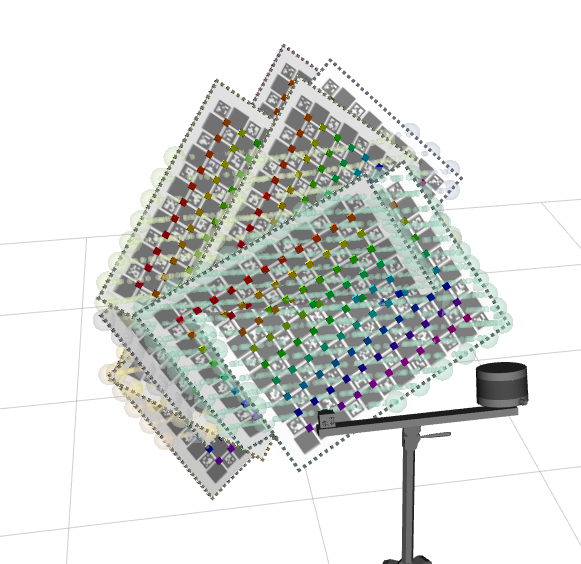

# RGB Lidar Robot (RLBOT)

The **rlbot** is a robotic system meant to be use in simple tests and to serve as example for ATOM beginners.

The system is composed of two rgb cameras mounted on a tripod.
Cameras are called **rgb_left** (red) and **rgb_right** (green).
The system contains the following topics:

  - /rgb_left/camera_info
  - /rgb_left/image_raw
  - /lidar_right/points
  - /tf
  - /tf_static

Since this is a systems to test calibration, where frame rate is not a critical issue, we restrained images topics to 10Hz.
This is a simulated system, which can be seen in gazebo:

... and in rviz:

# How to run

First launch the gazebo simulation:

    roslaunch rlbot_gazebo gazebo.launch

Then you can bringup the system:

    roslaunch rlbot_bringup bringup.launch

You can record a bag file using:

    roslaunch rlbot_bringup record.launch

This will put the bag file into your $ROS_BAGS folder.

# Calibration

The calibration of any robotic system using **ATOM** may have several variants. We recommend a careful reading of the [documentation](https://lardemua.github.io/atom_documentation/) to learn all the details.

In this section, out goal is to carry out the simplest possible calibration pipeline for the **rlbot**.

To calibrate, we will use the [$ROS_BAGS/rlbot/train.bag](https://drive.google.com/file/d/1UftkcLSTQV2VeQiz9n5vq8vPDwF5jnLp/view?usp=sharing) bagfile, which contains a recording of the system's data when viewing a calibration pattern in several positions. We produced the bagfile by bringing up the system and then recording a bagfile as described above.

Next we describe each of the steps in the calibration pipeline.

## Creating a calibration package

See also the [generic documentation](https://lardemua.github.io/atom_documentation/procedures/#create-a-calibration-package) on this topic.

Using ATOM conventions, we define name of the calibration package as **rlbot_calibration**, and create it using:

    rosrun atom_calibration create_calibration_pkg --name rlbot_calibration

**NOTE**: This procedure is carried out only once, and was done already. As such, this ros package is already [included in the atom repo](https://github.com/lardemua/atom/tree/noetic-devel/atom_examples/rlbot/rlbot_calibration). Therefore, you **should not execute this instruction** for the rlbot.

## Configuring the calibration

This is the [config.yml](https://github.com/lardemua/atom/blob/noetic-devel/atom_examples/rlbot/rlbot_calibration/calibration/config.yml) that we wrote to define the calibration. There are two sensors to be calibrated, named **rgb_left** and **rgb_right**. The pattern is a charuco marker.
The configuration file points to the bagfile mentioned above, and the _anchored_sensor_ is defined as the **rgb_left** sensor.

To configure run:

    rosrun rlbot_calibration configure

Which will run a series of checks and produce several files inside the **rlbot_calibration** package.

## Collecting a dataset

To collect a dataset we run:

    roslaunch rlbot_calibration collect_data.launch output_folder:=$ATOM_DATASETS/rlbot/dataset1 overwrite:=true

And save a few collections.

We will use as example the [train](https://drive.google.com/file/d/1kM3D4aUORKMxdsz9krnpeDSXNrmXxltp/view?usp=sharing) dataset, which contains several collection, 4 of them shown bellow.

Download and decompress the dataset to **$ATOM_DATASETS/rlbot/train**.

Collection |           rgb_left             |           lidar_right
:----------------:|:-------------------------:|:-------------------------:
0 |  |  
1 |  |  
2 |  |  
3 |  |  

## Running the Calibration

To calibrate, first setup visualization with:

    roslaunch rlbot_calibration calibrate.launch

To make sure this ATOM is actually calibrating sensor poses in simulated experiments, we use the --noise_initial_guess (-nig) flag. This makes the calibrate script add a random variation to the initial pose of the cameras, to be sure they are not located at the ground truth:

    rosrun atom_calibration calibrate -json $ATOM_DATASETS/rlbot/train/dataset.json -v -rv -nig 0.1 0.1

Which ends the calibration with these results:

Subpixel accuracy for the **rgb_left** sensor, and 4 millimeters error for the **lidar_right**. This means the procedure achieved a successful calibration.

The following image shows the system at the start of the calibration:

and the next image shows the system after calibration:

Notice how the **lidar_right** is positioned in the correct pose. Also, notice how the spheres, which denote labeled pattern boundary points, align much better with the estimated pattern poses.
