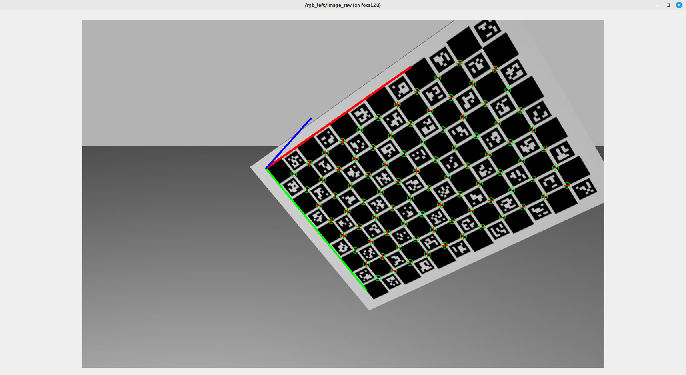
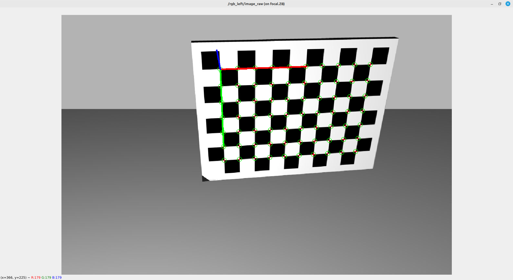
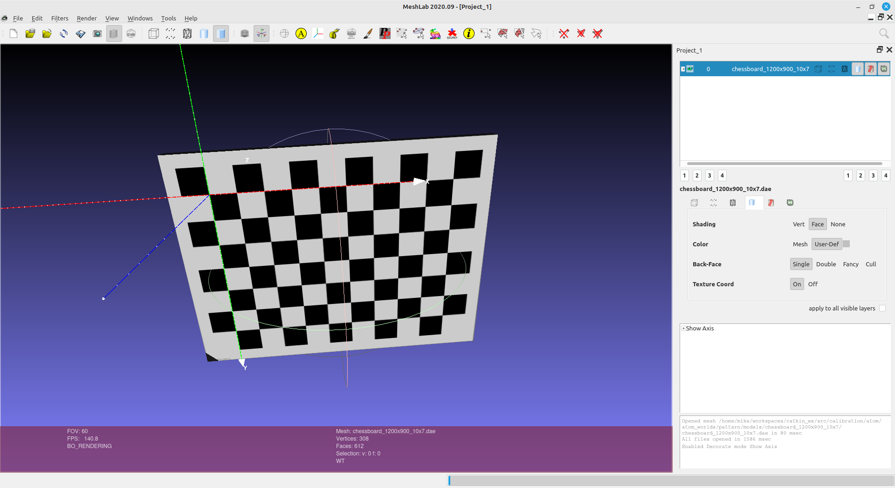

Launch calibration studio:

    roslaunch atom_worlds calibration_studio.launch

Spawn your robot.

Other options:
* launch_rviz - Whether to launch RViz or not.
* rviz_config - RViz configuration file.
* gui - Starts gazebo gui.
* world_name - World on Gazebo.
* paused - Starts gazebo in paused mode.

_________________

Run **interactive** pattern:

    rosrun atom_worlds interactive_pattern

Run **autonomous** pattern:

    rosrun atom_worlds autonomous_pattern

    rosrun atom_worlds autonomous_pattern -vi

Configure the camera topic on **camera.yaml**

Demo: https://youtu.be/7vii20Azfdk

_________________

Launch rosbag record, after configure the topics to record:

    roslaunch atom_worlds record_sensor_data.launch

# How to create new pattern

Chessboard patterns coordinate frames are located in ta different position when compared to charuco patterns.

For this reason we have to define the coordinate system of the patterns in accordance, i.e.:

Important tutorials:

https://blender.stackexchange.com/questions/36401/how-do-i-add-material-textures-to-only-one-face-of-an-object

https://blender.stackexchange.com/questions/31367/how-to-set-object-dimension

https://www.youtube.com/watch?v=Xhsn3aDkvWA